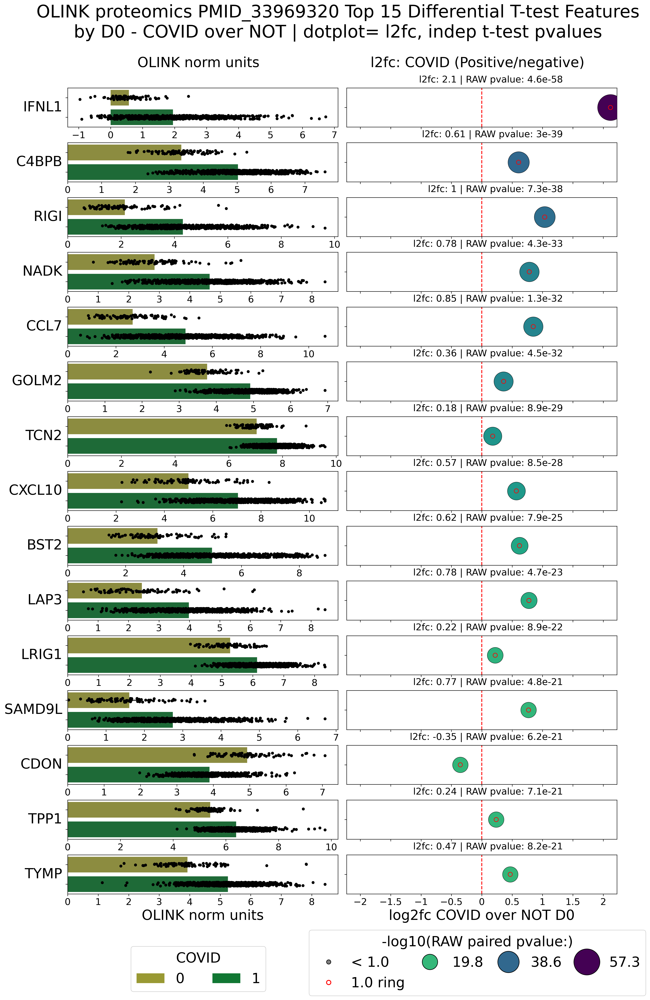

# adata_science_tools
data science tools that operate on anndata objects


### Set up
#### clone the repo
```bash
git clone https://github.com/gitbenlewis/adata_science_tools.git
```
#### Make the conda environments
```bash
conda deactivate
conda remove -n not_base --all
conda env create -f config/env_not_base.yaml -n not_base
conda activate not_base
```
#### run the examples
```bash
conda activate not_base
bash example_PMID_33969320/scripts/000_run_everything.bash
```


# Some example plots from example_PMID_33969320

# Column plots 
 > /adata_science_tools/_plotting/_column_plots.py
[view src file](_plotting/_column_plots.py)

## barh_l2fc_dotplot()
[View plot file](example_PMID_33969320/results/figures/diff_datapoint_plots/COVID_over_NOT_D0_barh_l2fc_dotplot.png)


