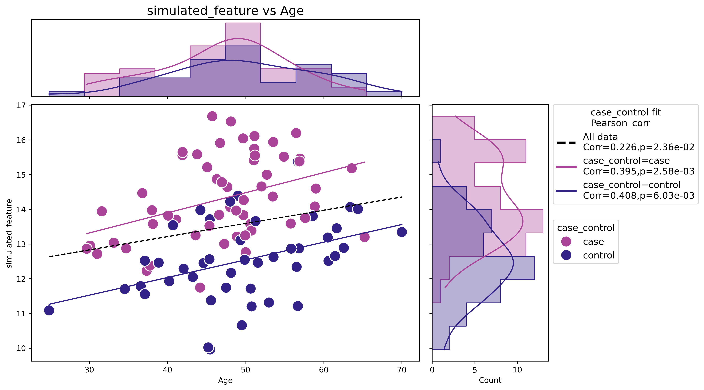
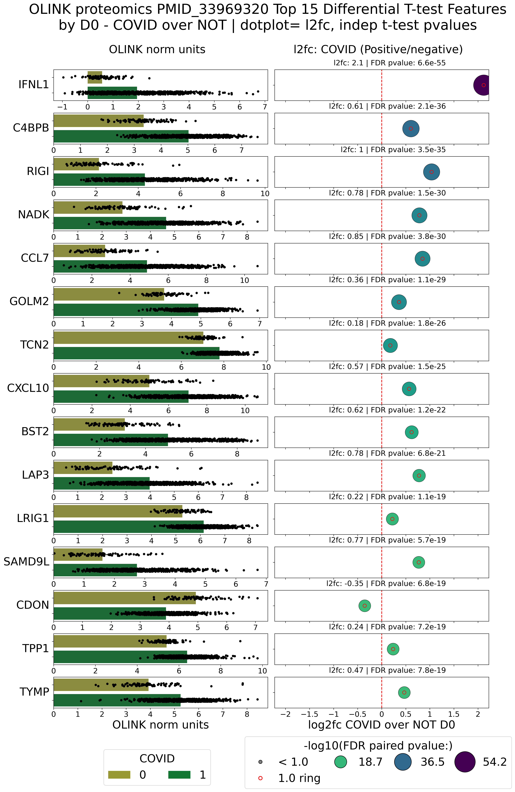
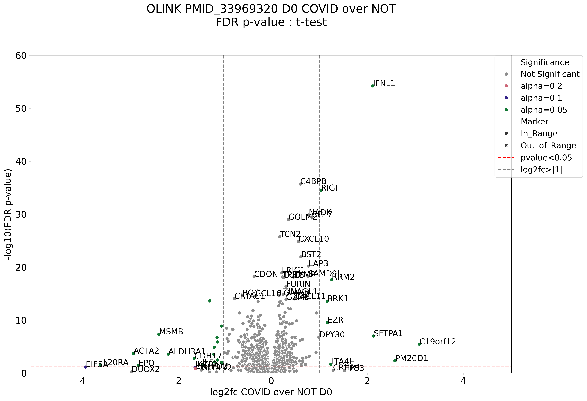

# adata_science_tools
data science tools that operate on anndata objects

### Set up
#### clone the repo
```bash
git clone https://github.com/gitbenlewis/adata_science_tools.git
```
#### Make the conda environments
```bash
conda deactivate
conda remove -n not_base --all
conda env create -f config/env_not_base.yaml -n not_base
conda activate not_base
```
#### run the examples
```bash
conda activate not_base
bash example_PMID_33969320/scripts/000_run_everything.bash
python example_simulated_data/scripts/simulate_1_var_covar_age.py
python example_simulated_data/scripts/plot_dotplot_simulate_1_var_covar_age.py
```

## Docs

- [Docs index](docs/README.md)
- [Simulation helpers](docs/_simulate_data.md)
- [Correlation dotplots](docs/_corr_dotplots.md)

## Simulated data example

The repo includes a small config-driven simulated-data workflow in `example_simulated_data/`.

```bash
conda activate not_base
python example_simulated_data/scripts/simulate_1_var_covar_age.py
python example_simulated_data/scripts/plot_dotplot_simulate_1_var_covar_age.py
```

The default config in [`example_simulated_data/config/config.yaml`](example_simulated_data/config/config.yaml) simulates one feature, `simulated_feature`, from `Age` and `case_control`, adds residual `y` variance so the points are not constrained to exact fit lines, and writes both a baseline `AnnData` bundle and a dotplot.

The main example knobs are `beta` or `beta_age`, `beta_case_control`, `case_control_prob`, and `residual_stdev`.

See [`docs/_simulate_data.md`](docs/_simulate_data.md) for the simulation API and config details, and [`docs/_corr_dotplots.md`](docs/_corr_dotplots.md) for the plotting API.

Example outputs: [baseline.h5ad](example_simulated_data/results/simulate_1_var_covar_age/baseline/baseline.h5ad) and [baseline.png](example_simulated_data/results/plot_dotplot_simulate_1_var_covar_age/baseline/baseline.png).




# Some example plots from example_PMID_33969320

## Column plots 
 > /adata_science_tools/_plotting/_column_plots.py
[view src file](_plotting/_column_plots.py)

### adtl.barh_l2fc_dotplot()
[View plot file](example_PMID_33969320/results/figures/diff_datapoint_plots/COVID_over_NOT_D0_barh_l2fc_dotplot_FDR.png)



## Volcano plots 

### adtl.volcano_plot_generic()
[View plot file](example_PMID_33969320/results/figures/volcano_plots/COVID_over_NOT_D0_volcano_FDR.png)

