# `_column_plots`

Per-feature distribution and effect-column figure builders from
`_plotting/_column_plots.py`.

These functions are the package's main helpers for per-feature distribution
columns and composite distribution-plus-effect layouts.

## Public entry points

- `datapoints_effect_panels_column` (preferred composite API)
- `barh_column`
- `l2fc_dotplot_single`
- `l2fc_dotplot_column`
- `barh_l2fc_dotplot_column`
- `vbar_l2fc_dotplot_column`
- `barh_dotplot_dotplot_column`
- `barh_dotplot_dotplot_dotplot_column`
- `barh_4X_dotplot_column`

## Shared data model

Most functions support one of these input paths:

- `adata`, optionally with `layer`
- explicit `x_df`, `obs_df`, and `var_df`

Shared expectations:

- `feature_list` is required for every feature-oriented plot.
- Distribution panels read expression values from `adata.X`,
  `adata.layers[layer]`, or `x_df`.
- Effect panels read per-feature statistics from `adata.var` or `var_df`.
- Grouping for distributions comes from `comparison_col` in `adata.obs` or
  `obs_df`.

## Choosing a column renderer

| Renderer | Distribution orientation | Distribution layers | Effect display |
| --- | --- | --- | --- |
| `datapoints_effect_panels_column` (preferred) | horizontal or vertical | bar, box, or violin; optional observations | one or more ordered p-value or supplied-confidence-interval panels |
| `barh_column` | horizontal | bar, box, or violin; optional observations | none |
| `barh_l2fc_dotplot_column` | horizontal | bar, box, or violin; optional observations | one p-value-encoded effect column |
| `barh_dotplot_dotplot_column` | horizontal | bar, box, or violin; optional observations | two p-value-encoded effect columns |
| `barh_dotplot_dotplot_dotplot_column` | horizontal | bar, box, or violin; optional observations | three p-value-encoded effect columns |
| `barh_4X_dotplot_column` | horizontal | bar, box, or violin; optional observations | four p-value-encoded effect columns |
| `vbar_l2fc_dotplot_column` | vertical | bar, box, or violin; optional color/shape observations | supplied effect and confidence interval |
| `l2fc_dotplot_column` | none | none | p-value encoding or supplied confidence interval |

`orientation` and `effect_mode` are independent in the preferred API. For
example, horizontal distributions can be paired with p-value-encoded effects,
while vertical distributions can be paired with supplied confidence intervals;
either effect mode is available in either orientation.

For the distribution column, `distribution_kind="bar"` preserves the historical
default. Use `"box"` to show quartiles and whiskers or `"violin"` to show a
kernel-density summary. `include_stripplot` independently controls whether raw
observations are drawn over the selected summary layer.

## `datapoints_effect_panels_column`

Use `datapoints_effect_panels_column(...)` for new composite plots. It gives every
selected feature one distribution panel and one or more effect panels. The
scalar effect arguments return the established `(n_features, 2)` axes array;
an ordered `effect_panels` list returns an `(n_features, 1 + N)` array for `N`
effect panels. Both shapes remain two-dimensional for one-feature calls.

### Full signature

```python
def datapoints_effect_panels_column(
        adata: anndata.AnnData | None = None,
        *,
        layer: str | None = None,
        x_df: pd.DataFrame | None = None,
        obs_df: pd.DataFrame | None = None,
        var_df: pd.DataFrame | None = None,
        feature_list: list[str] | None = None,
        orientation: str = "horizontal",
        effect_mode: str = "pvalue",
        effect_panels: list[dict] | None = None,
        comparison_col: str = "Treatment",
        comparison_order: list[str] | None = None,
        feature_label_vars_col: str | None = None,
        feature_label_char_limit: int | None = None,
        feature_labels_as_ylabels: bool = False,
        feature_label_x: float = -0.02,
        feature_label_fontsize: float | None = None,
        remove_group_tick_labels: bool = False,
        comparison_axis_label: str | None = None,
        distribution_kind: str = "bar",
        include_stripplot: bool = True,
        distribution_palette: dict | None = None,
        point_color_column: str | None = None,
        point_shape_column: str | None = None,
        point_palette: dict | None = None,
        point_markers: dict | None = None,
        point_jitter: float | None = None,
        point_size: float | None = None,
        effect_column: str = "log2FoldChange",
        pvalue_column: str = "pvalue",
        ci_low_column: str = "ci_low",
        ci_high_column: str = "ci_high",
        effect_marker_size: float = 5,
        effect_color: str = "black",
        pvalue_cutoff: float = 0.1,
        share_pvalue_scale: bool = False,
        effect_reference_value: float | None = 0,
        share_distribution_axis: bool = False,
        distribution_axis_limits: tuple[float, float] | None = None,
        share_effect_x: bool = False,
        effect_xlim: tuple[float, float] | None = None,
        figsize: tuple[float, float] | None = None,
        width_ratios: tuple[float, ...] | list[float] = (3.0, 1.0),
        fig_title: str | None = None,
        fig_title_y: float = 0.995,
        fig_title_fontsize: float | None = None,
        distribution_title: str | None = None,
        column_title_y: float | None = None,
        column_title_fontsize: float | None = None,
        distribution_axis_label: str = "Expression",
        effect_axis_label: str = "log2FoldChange",
        tick_label_fontsize: float | None = None,
        legend_fontsize: float | None = None,
        numeric_tick_format: str | None = None,
        axis_labels_outer_only: bool = False,
        row_hspace: float | None = None,
        col_wspace: float | None = None,
        legend: bool = True,
        distribution_legend: bool | None = None,
        distribution_legend_loc: str = "upper center",
        distribution_legend_bbox_to_anchor: tuple[float, float] | None = None,
        distribution_legend_frameon: bool = False,
        tight_layout_rect: tuple[float, float, float, float] | None = None,
        use_tight_layout: bool = True,
        footer: str | None = None,
        savefig: bool = False,
        file_name: str = "datapoints_effect_panels_column.png",
):
```

### Input and mode contract

- Supply either `adata` or all three aligned tables: wide `x_df`, observation
  metadata `obs_df`, and feature-indexed metadata `var_df`. Rows of `x_df` and
  `obs_df` must align, and columns of `x_df` must contain the unique identifiers
  in `feature_list`.
- `orientation="horizontal"` or `"vertical"` controls only the distribution
  panels. `effect_mode="pvalue"` or `"interval"` independently controls the
  single scalar effect panel. With `effect_panels`, each panel selects its own
  mode, so p-value and supplied-interval panels can appear in the same figure.
- P-value mode reads `effect_column` and `pvalue_column` from feature metadata.
  P-values must be finite values from 0 through 1. Point size and color encode
  significance, and `pvalue_cutoff` controls the threshold ring.
- Interval mode reads `effect_column`, `ci_low_column`, and `ci_high_column`
  from feature metadata. The bounds must be finite and satisfy
  `ci_low <= effect <= ci_high`.
- Confidence intervals are supplied plotting metadata. This function never
  estimates an effect, p-value, or interval from the expression observations.
- `effect_panels` must be a non-empty ordered list of dictionaries. Every
  dictionary requires `effect_mode` and `effect_column`, plus `pvalue_column`
  in p-value mode or both `ci_low_column` and `ci_high_column` in interval
  mode. Panel order is exactly list order. Optional keys are `title`,
  `pvalue_cutoff`, `effect_reference_value`, `effect_axis_label`,
  `share_effect_x`, `effect_xlim`, `pvalue_sizes`, `pvalue_label`, `legend`,
  `legend_bins`, `legend_bbox_to_anchor`, `annotate`, `annotate_xy`,
  `annotate_labels`, `annotate_fontsize`, `effect_marker_size`, and
  `effect_color`. Unknown keys are rejected so a
  misspelled control cannot silently change a figure. Explicit
  `pvalue_sizes=None` retains the established marker-area default. Omitting
  `legend_bins` uses four bins, while explicit `legend_bins=None` retains the
  legacy three-bin fallback. Default annotations are labeled as effect plus
  p-value in p-value mode and effect plus CI in interval mode.
- `share_pvalue_scale=True` gives all participating p-value panels one color
  normalization, one marker-size scale, and one legend. Those panels must use
  the same `pvalue_cutoff` and `pvalue_sizes`; otherwise the call is rejected.
  Interval panels do not participate in this scale. If more than one p-value
  panel has `legend=True`, their `pvalue_label`, `legend_bins`, and
  `legend_bbox_to_anchor` settings must also match; alternatively, enable the
  legend only on the panel that should configure the shared legend.
- `distribution_kind` selects `"bar"`, `"box"`, or `"violin"`, while
  `include_stripplot` independently controls individual observations.
  `point_color_column` and `point_shape_column` map observation metadata to
  point color and marker shape when those observations are shown. The shared
  legend includes only displayed levels; redundant group handles are omitted
  when every distribution group uses the same fill color.
- `share_distribution_axis` shares the numeric distribution axis: x for
  horizontal distributions and y for vertical distributions.
  `share_effect_x` independently shares the single scalar effect panel's x
  axes; the same key in an `effect_panels` entry applies within that effect
  column. Horizontal p-value panels retain one symmetric, column-wide effect
  range even when their axes are not linked, preserving comparisons between
  feature rows. A two-value `width_ratios=(distribution, effect)` is expanded
  across all effect columns, or supply exactly `N + 1` values for
  panel-specific widths.
- `legend` retains the existing scalar behavior. For multi-effect calls,
  `distribution_legend=None` inherits `legend`, while an explicit boolean
  controls the distribution legend independently and each effect dictionary
  can control its own legend. A panel's `legend_bbox_to_anchor=(x, y)` is
  interpreted in that effect column's frame, matching the numbered legacy
  dotplot controls rather than placing every legend in the full-figure frame.
- The optional label, title, spacing, legend-position, and footer controls
  reproduce the visible content of the compatibility renderers without
  changing their supplied observations or feature statistics. In particular,
  `feature_labels_as_ylabels=True`, `remove_group_tick_labels=True`, and
  `axis_labels_outer_only=True` reproduce the compact horizontal rows;
  `distribution_title` and each effect panel's `title` label the columns. With
  `column_title_y=None`, those headers are placed above first-row titles and
  annotations; an explicit `column_title_y` is interpreted in figure
  coordinates. A supplied `distribution_legend_bbox_to_anchor=(x, y)` uses
  the distribution column's frame, parallel to effect-panel legend anchors.
- Calling the renderer displays the figure through Matplotlib, matching the
  existing column-plot family. `savefig=True` additionally writes `file_name`.

### Gallery examples

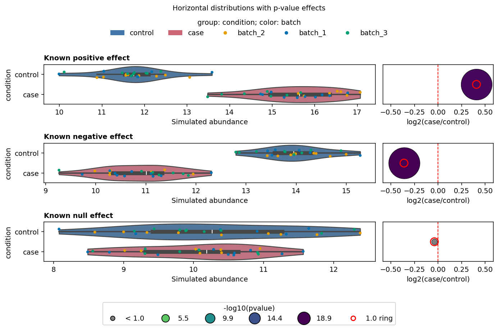

*`horizontal_pvalue` — Horizontal violin distributions paired with
p-value-encoded effects from deterministic library-derived differential-test
results. [Data and analysis provenance](plotting_gallery.md#data-and-analysis-provenance).*

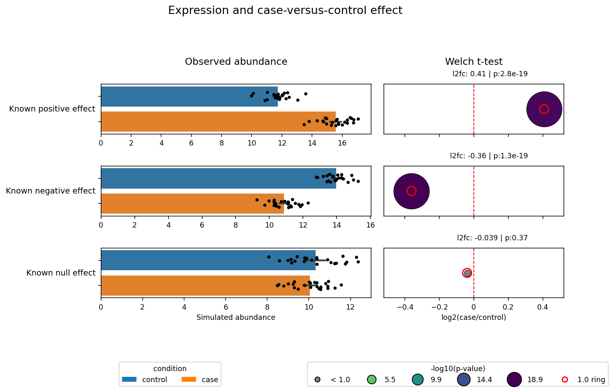

*`horizontal_one_effect` — Legacy-style grouped abundance and one annotated
p-value effect panel, replacing `barh_l2fc_dotplot_column` for new figures.
[Data and analysis provenance](plotting_gallery.md#data-and-analysis-provenance).*

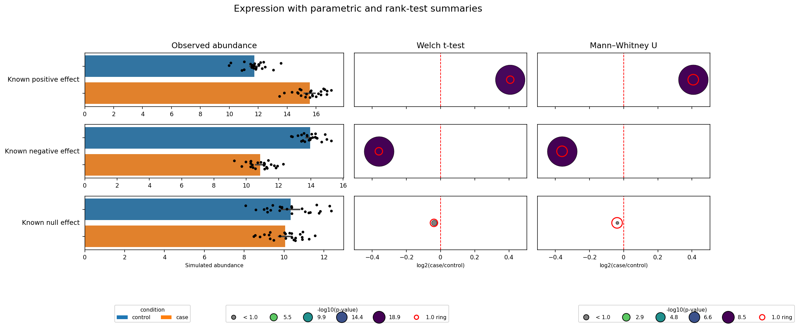

*`horizontal_two_effects` — Grouped abundance with parametric and rank-test
effect panels, replacing `barh_dotplot_dotplot_column` for new figures.
[Data and analysis provenance](plotting_gallery.md#data-and-analysis-provenance).*

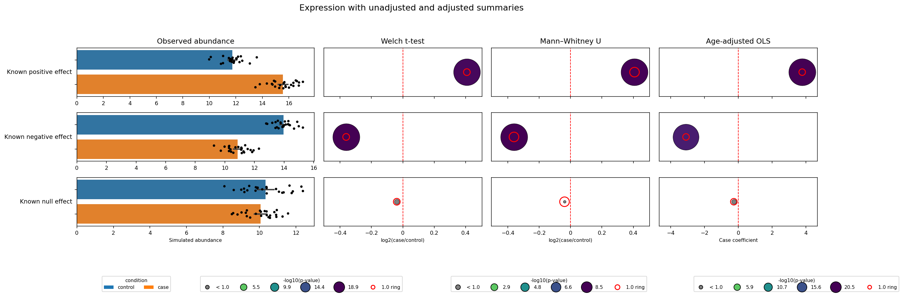

*`horizontal_three_effects` — Grouped abundance with two unadjusted panels and
one adjusted OLS panel, replacing `barh_dotplot_dotplot_dotplot_column` for new
figures. [Data and analysis provenance](plotting_gallery.md#data-and-analysis-provenance).*

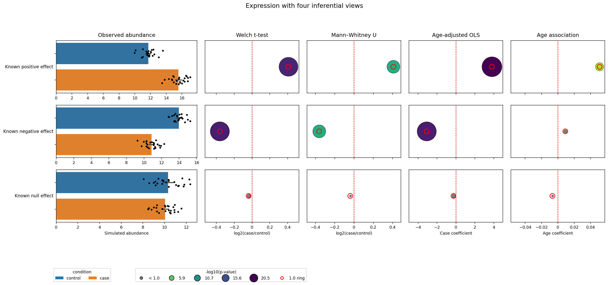

*`horizontal_four_effects` — One horizontal distribution column paired with
four ordered p-value panels on a shared color and marker-size scale, replacing
`barh_4X_dotplot_column` for new figures.
[Data and analysis provenance](plotting_gallery.md#data-and-analysis-provenance).*

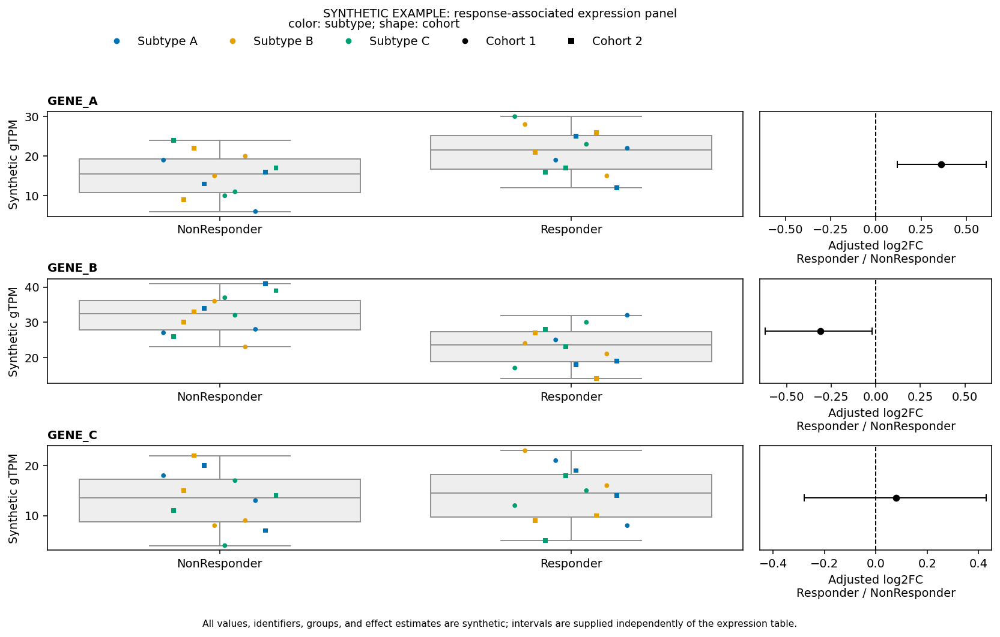

*`vertical_interval` — Vertical boxplots paired with independently supplied
synthetic effect intervals, replacing `vbar_l2fc_dotplot_column` for new
figures. [Data and analysis provenance](plotting_gallery.md#data-and-analysis-provenance).*

### Migrating from legacy composite renderers

| Compatibility renderer | Unified gallery case | Effect configuration |
| --- | --- | --- |
| `barh_l2fc_dotplot_column` | `horizontal_one_effect` | one p-value panel |
| `barh_dotplot_dotplot_column` | `horizontal_two_effects` | two ordered p-value panels |
| `barh_dotplot_dotplot_dotplot_column` | `horizontal_three_effects` | three ordered p-value panels |
| `barh_4X_dotplot_column` | `horizontal_four_effects` | four ordered panels with a shared p-value scale |
| `vbar_l2fc_dotplot_column` | `vertical_interval` | one supplied-interval panel beside vertical distributions |

Calls using the wide/AnnData `barh_l2fc_dotplot_column(...)` data model can move
directly to the preferred API. Rename the effect-column arguments and set the
distribution orientation and effect mode explicitly:

```python
fig, axes = adtl.datapoints_effect_panels_column(
    adata=adata,
    layer="pgml",
    feature_list=feature_list,
    comparison_col="Treatment",
    comparison_order=["control", "case"],
    orientation="horizontal",
    effect_mode="pvalue",
    effect_column="log2FoldChange",
    pvalue_column="FDR",
    distribution_kind="box",
)
```

The long-form `vbar_l2fc_dotplot_column(...)` contract requires one explicit
reshape. Sample metadata must be invariant across feature rows before it is
deduplicated:

```python
sample_metadata = (
    expression_df.drop_duplicates("sample_id")
    .set_index("sample_id")[["response_group", "subtype", "cohort"]]
)
x_df = expression_df.pivot(
    index="sample_id",
    columns="feature",
    values="gtpm",
).reindex(sample_metadata.index)
var_df = effects_df.set_index("feature")

fig, axes = adtl.datapoints_effect_panels_column(
    x_df=x_df,
    obs_df=sample_metadata,
    var_df=var_df,
    feature_list=["GENE_A", "GENE_B", "GENE_C"],
    comparison_col="response_group",
    comparison_order=["NonResponder", "Responder"],
    orientation="vertical",
    effect_mode="interval",
    effect_column="adjusted_log2fc",
    ci_low_column="ci_low",
    ci_high_column="ci_high",
    distribution_kind="box",
    point_color_column="subtype",
    point_shape_column="cohort",
)
```

The existing entry points remain public for compatibility with their established
signatures and return conventions. `barh_l2fc_dotplot_column(...)` retains its
historical horizontal parameter names, while `vbar_l2fc_dotplot_column(...)`
remains the specialized long-form response-panel API with a separate effects
table. `l2fc_dotplot_column(...)` remains effect-only, with no distribution
panel.

The legacy two-, three-, and four-effect functions can migrate by placing each
numbered dotplot argument set into one ordered dictionary. For example, the
shared list below replaces the `dotplot_*`, `dotplot2_*`, `dotplot3_*`, and
`dotplot4_*` families without changing the supplied feature statistics:

```python
effect_panels = [
    {
        "title": "title_1",
        "effect_mode": "pvalue",
        "effect_column": "log2FoldChange",
        "pvalue_column": "pvalue",
        "effect_axis_label": "log2FC",
        "pvalue_label": "-log10(p-value)",
    },
    {
        "title": "title_2",
        "effect_mode": "pvalue",
        "effect_column": "log2FoldChange_alt",
        "pvalue_column": "pvalue_alt",
        "effect_axis_label": "alternate log2FC",
        "pvalue_label": "-log10(p-value)",
    },
    {
        "title": "title_3",
        "effect_mode": "pvalue",
        "effect_column": "log2FoldChange_alt2",
        "pvalue_column": "pvalue_alt2",
        "effect_axis_label": "adjusted log2FC",
        "pvalue_label": "-log10(p-value)",
    },
    {
        "title": "title_4",
        "effect_mode": "pvalue",
        "effect_column": "log2FoldChange_alt3",
        "pvalue_column": "pvalue_alt3",
        "effect_axis_label": "alternate adjusted log2FC",
        "pvalue_label": "-log10(p-value)",
    },
]

common = dict(
    adata=adata,
    feature_list=feature_list,
    comparison_col="Treatment",
    orientation="horizontal",
    distribution_kind="bar",
)

# barh_dotplot_dotplot_column
fig, axes = adtl.datapoints_effect_panels_column(
    **common,
    effect_panels=effect_panels[:2],
)

# barh_dotplot_dotplot_dotplot_column
fig, axes = adtl.datapoints_effect_panels_column(
    **common,
    effect_panels=effect_panels[:3],
)

# barh_4X_dotplot_column
fig, axes = adtl.datapoints_effect_panels_column(
    **common,
    effect_panels=effect_panels,
    share_pvalue_scale=True,
)
```

The compatibility functions remain public for established signatures and their
`(fig, subfigs)` return behavior. The preferred API returns `(fig, axes)`. Its
replacement examples preserve the visible panel structure, plotted values,
encodings, titles, labels, legends, reference lines, annotations, and synthetic
disclaimer; only exact pixel identity and the internal SubFigure topology are
outside the replacement contract.

## `barh_column`

Use `barh_column(...)` for a single column of horizontal grouped bar plots, with optional stripplot overlays.

### Full signature

```python
def barh_column(
        adata: anndata.AnnData | None = None,
        use_adata_raw: bool = False,
        layer: str | None =None,
        x_df: pd.DataFrame | None = None,
        var_df: pd.DataFrame | None = None,
        obs_df: pd.DataFrame | None = None,
        feature_list=None,
        feature_label_vars_col: str | None = None,# if None then index is used
        include_stripplot: bool = True,
        feature_label_char_limit: int | None= 25,
        feature_label_x: float = -0.02,
        figsize: tuple[int, int] = (10, 30),
        fig_title: str | None = None,
        fig_title_y: float | None = .99,
        fig_title_fontsize: int | None = 30,
        feature_label_fontsize: int | None= 24,
        tick_label_fontsize: int | None= 20,
        legend_fontsize: int | None= 24,
        tight_layout_rect_arg=[0, .05, 1, .99],
        comparison_col: str | None = 'Treatment',
        barh_remove_yticklabels: bool = True,
        comparison_order: list[str] | None = None,
        barh_subplot_xlabel: str | None = 'Expression (TPM)',
        barh_sharex: bool = False,
        barh_set_xaxis_lims: tuple[int, int]| None = None,
        barh_legend: bool = True,
        barh_legend_bbox_to_anchor: tuple[float, float] | None = (0.5, -.05),
        savefig: bool = False,
        file_name: str = 'test_plot.png',
        distribution_kind: str = "bar",
        point_color_column: str | None = None,
        point_shape_column: str | None = None,
        point_palette: dict | None = None,
        point_markers: dict | None = None,
        point_jitter: float | None = None,
        point_size: float | None = None,
):
```

```python
fig, axes = adtl.barh_column(
    adata=adata,
    layer="pgml",
    feature_list=["IL6", "TNF", "CXCL10"],
    comparison_col="Treatment",
    include_stripplot=True,
    savefig=True,
    file_name="results/barh_column.png",
)
```

### Gallery example

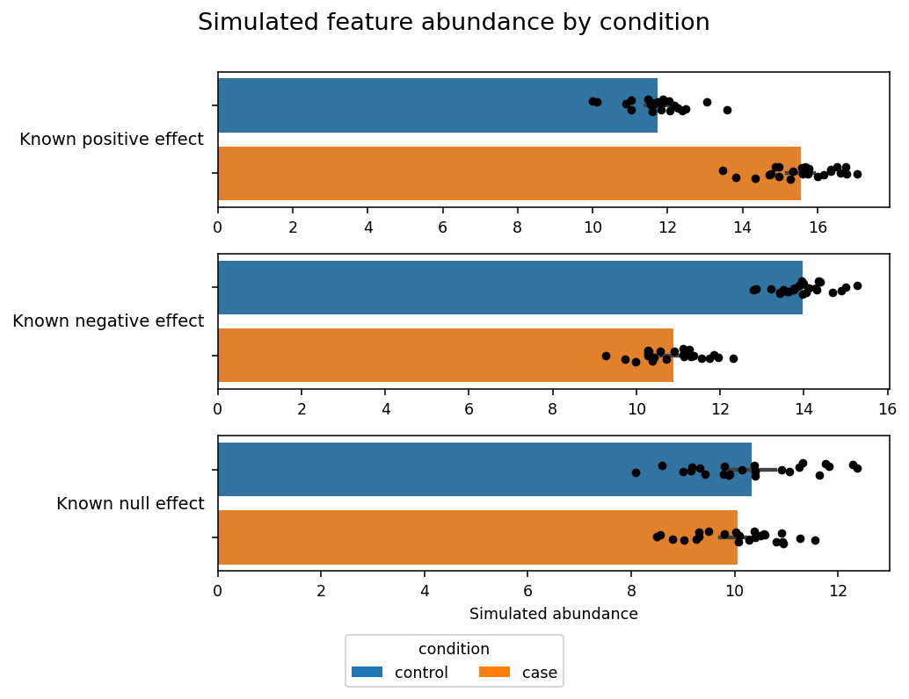

*`grouped_expression` — Feature abundance by treatment. [Data and analysis provenance](plotting_gallery.md#data-and-analysis-provenance).*

Important behavior:

- `feature_list` is required.
- `use_adata_raw=True` switches to `adata.raw.to_adata()`.
- Sparse matrices are densified before building the plotting `DataFrame`.
- `comparison_order` fixes category order when provided.
- `distribution_kind` selects `"bar"`, `"box"`, or `"violin"` without changing
  the horizontal orientation.
- `point_color_column` and `point_shape_column` optionally map observation
  metadata to color and marker shape. When both are omitted, the historical
  black strip-point overlay is retained.
- `feature_label_vars_col` is used for display labels when available; otherwise the feature index is used.
- The function returns `(fig, axes)`.

## `l2fc_dotplot_single`

Use `l2fc_dotplot_single(...)` for one dotplot axis summarizing log2 fold change and p-value significance for a list of features.

### Full signature

```python
def l2fc_dotplot_single(
    adata: anndata.AnnData | None = None,
    var_df: pd.DataFrame | None = None,
    feature_list: list[str] | None = None,
    feature_label_vars_col: str | None = None,
    feature_label_char_limit: int | None = 25,
    figsize: tuple[int, int] = (8, 10),
    fig_title: str | None = None,
    fig_title_y: float = 1.02,
    feature_label_fontsize: int | None = 14,
    tick_label_fontsize: int | None = 12,
    legend_fontsize: int | None = 14,
    dotplot_pval_vars_col_label: str = 'pvalue',
    dotplot_l2fc_vars_col_label: str = 'log2FoldChange',
    dotplot_subplot_xlabel: str = 'log2fc ((target)/(ref))',
    pval_label: str = 'p-value',
    pvalue_cutoff_ring: float = 0.1,
    sizes: tuple[int, int] = (20, 2000),
    dotplot_set_xaxis_lims: tuple[int, int] | None = None,
    dotplot_legend: bool = True,
    dotplot_legend_bins: int | None = 4,
    dotplot_legend_bbox_to_anchor: tuple[float, float] = (0.5, -0.05),
    dotplot_annotate: bool = False,
    dotplot_annotate_fontsize: int | None = None,
    tight_layout_rect_arg: tuple[float, float, float, float] | None = None,
):
```

```python
fig, ax = adtl.l2fc_dotplot_single(
    adata=adata,
    feature_list=["IL6", "TNF", "CXCL10"],
    dotplot_pval_vars_col_label="pvalue",
    dotplot_l2fc_vars_col_label="log2FoldChange",
)
```

### Gallery example

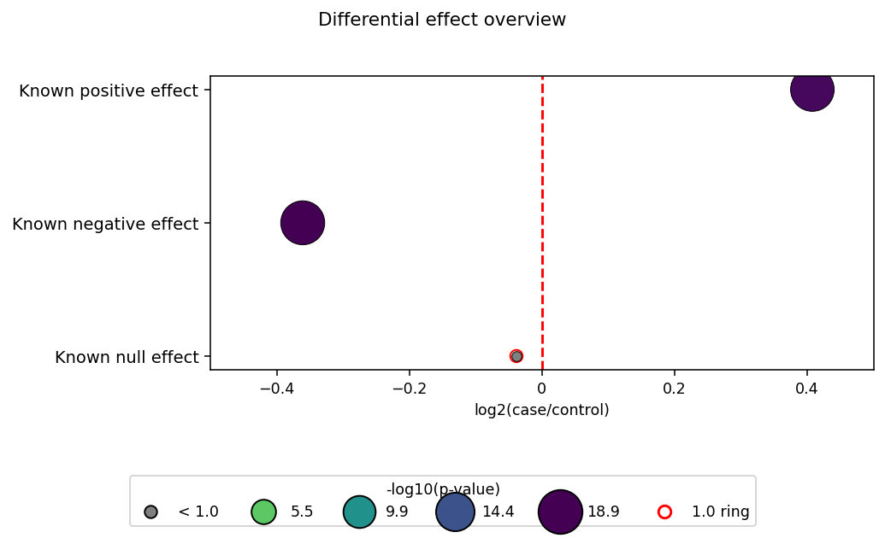

*`single_axis` — Differential effect overview. [Data and analysis provenance](plotting_gallery.md#data-and-analysis-provenance).*

Important behavior:

- Requires `adata` or `var_df`.
- Requires both the p-value column and the log2 fold-change column in `var_df`.
- Points below the threshold are greyed out.
- A red ring marks the `pvalue_cutoff_ring` threshold in `-log10(p)` space.
- `tight_layout_rect_arg` optionally reserves figure space when applying
  `tight_layout`; the default preserves the legacy conditional bottom margin
  used when the legend is enabled.
- The return value is `(fig, ax)`.

## `l2fc_dotplot_column`

Use `l2fc_dotplot_column(...)` for a vertically stacked column of one-feature-per-row dotplots.

### Full signature

```python
def l2fc_dotplot_column(
        # shared parameters
        adata: anndata.AnnData | None = None,
        var_df: pd.DataFrame | None = None,
        feature_list: list[str] | None = None,  # index of adata.var / var_df
        feature_label_vars_col: str | None = None,  # if None then index is used
        feature_label_char_limit: int | None = 25,
        feature_label_x: float = -0.02,
        figsize: tuple[int, int] | None = (8, 12),
        fig_title: str | None = None,
        fig_title_y: float = 1.03,
        subfig_title_fontsize: int | None = 24,
        feature_label_fontsize: int | None = 24,
        tick_label_fontsize: int | None = 20,
        legend_fontsize: int | None = 24,
        tight_layout_rect_arg: list[float] | None = [0, 0, 1, 1],
        savefig: bool = False,
        file_name: str = 'l2fc_dotplot.png',
        # dotplot specific parameters (mirrors barh_l2fc_dotplot_column)
        dotplot_figure_plot_title: str | None = 'log2fc',
        dotplot_pval_vars_col_label: str | None = 'pvalue',
        dotplot_l2fc_vars_col_label: str | None = 'log2FoldChange',
        dotplot_subplot_xlabel: str | None = 'log2fc ((target)/(ref))',
        pval_label: str = 'p-value',
        pvalue_cutoff_ring: float = 0.1,
        sizes: tuple[int, int] | None = (20, 2000),
        dotplot_sharex: bool = False,
        dotplot_set_xaxis_lims: tuple[int, int] | None = None,
        dotplot_legend: bool = True,
        dotplot_legend_bins: int | None = 4,
        dotplot_legend_bbox_to_anchor: tuple[int, int] | None = (0.5, -.005),
        # Optional annotation on the dotplot with l2fc and p-value
        dotplot_annotate: bool = False,
        dotplot_annotate_xy: tuple[float, float] | None = (0.8, 1.2),
        dotplot_annotate_fontsize: int | None = None,
        dotplot_ci_low_vars_col_label: str | None = None,
        dotplot_ci_high_vars_col_label: str | None = None,
        dotplot_ci_marker_size: float = 5,
        dotplot_ci_color: str = "black",
        dotplot_reference_value: float | None = 0,
    ):
```

```python
fig, axes = adtl.l2fc_dotplot_column(
    adata=adata,
    feature_list=feature_list,
    dotplot_pval_vars_col_label="paired_pvalue",
    dotplot_l2fc_vars_col_label="log2FoldChange",
    dotplot_sharex=True,
)
```

### Gallery example

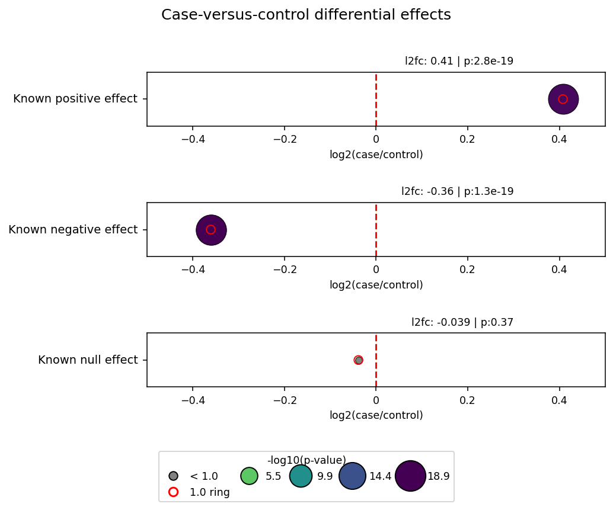

*`multi_feature` — Differential effects by feature. [Data and analysis provenance](plotting_gallery.md#data-and-analysis-provenance).*

Important behavior:

- Accepts `adata` or `var_df`.
- Returns `(fig, ax)` for a single feature and `(fig, axes)` for multiple features.
- Optional annotation text uses the current feature's log2 fold change and p-value.
- Supplying both confidence-interval column parameters switches to interval
  mode: a fixed point and horizontal interval replace the p-value size, color,
  threshold ring, and legend.
- Interval mode validates finite numeric values and requires
  `ci_low <= effect <= ci_high`. It does not estimate intervals from expression
  observations.

## `vbar_l2fc_dotplot_column`

Use `vbar_l2fc_dotplot_column(...)` for the response-panel layout: vertically
oriented group distributions on the left and supplied feature effects with
confidence intervals on the right.

### Full signature

```python
def vbar_l2fc_dotplot_column(
        expression_df: pd.DataFrame,
        effects_df: pd.DataFrame,
        feature_list: list[str],
        feature_column: str = "feature",
        value_column: str = "gtpm",
        comparison_column: str = "response_group",
        comparison_order: list[str] | None = None,
        point_color_column: str | None = None,
        point_shape_column: str | None = None,
        effect_column: str = "adjusted_log2fc",
        ci_low_column: str = "ci_low",
        ci_high_column: str = "ci_high",
        distribution_kind: str = "bar",
        include_stripplot: bool = True,
        distribution_palette: dict | None = None,
        point_palette: dict | None = None,
        point_markers: dict | None = None,
        point_jitter: float = 0.16,
        point_size: float = 4,
        effect_marker_size: float = 5,
        effect_color: str = "black",
        effect_reference_value: float | None = 0,
        effect_xlim: tuple[float, float] | None = None,
        share_effect_x: bool = False,
        figsize: tuple[float, float] = (12, 8),
        width_ratios: tuple[float, float] = (3.0, 1.0),
        fig_title: str | None = None,
        fig_title_y: float = 1.04,
        value_axis_label: str = "Synthetic abundance",
        effect_axis_label: str = "Adjusted log2FC",
        legend: bool = True,
        legend_bbox_to_anchor: tuple[float, float] = (0.5, 0.99),
        tight_layout_rect_arg: list[float] | None = [0, 0, 1, 0.94],
        footer: str | None = None,
        savefig: bool = False,
        file_name: str = "vbar_l2fc_dotplot.png",
):
```

### Parameter semantics

- `expression_df` is a long-form observation table. `feature_column`,
  `value_column`, and `comparison_column` identify the feature, numeric value,
  and group fields; `feature_list` fixes the displayed row order.
- `effects_df` supplies one row per plotted feature. `effect_column`,
  `ci_low_column`, and `ci_high_column` identify the point estimate and interval
  limits. The renderer validates finite values and
  `ci_low <= effect <= ci_high`, but performs no statistical estimation.
- `comparison_order` fixes the left-panel group order. When omitted, first
  observed order among the selected feature rows is used.
- `distribution_kind` selects a bar, box, or violin summary.
  `include_stripplot` independently controls the observation overlay.
- `distribution_palette` maps comparison groups to summary-layer colors.
  `point_color_column` plus `point_palette` map observation colors, while
  `point_shape_column` plus `point_markers` map marker shapes.
- `point_jitter` controls displacement along the categorical axis and
  `point_size` controls observation marker size.
- `effect_marker_size`, `effect_color`, and `effect_reference_value` style the
  supplied effect and interval. Set `effect_reference_value=None` to omit the
  dashed reference line.
- `effect_xlim` sets the effect-panel limits explicitly. When omitted and
  `share_effect_x=False`, each row receives a symmetric limit spanning that
  feature's interval and the reference value. With `share_effect_x=True`, one
  symmetric limit spanning all selected intervals is applied to every effect
  row.
- `share_effect_x=True` links only the effect-panel x axes so they share limits,
  ticks, and interactive zoom. The categorical expression axes remain
  independent.
- `figsize`, `width_ratios`, `fig_title`, `fig_title_y`, `value_axis_label`, and
  `effect_axis_label` control figure geometry and labels.
- `legend` controls the shared point-encoding legend;
  `legend_bbox_to_anchor` positions it. `footer` adds figure-level provenance
  text, and `tight_layout_rect_arg` reserves space around the panels.
- `savefig=True` writes the figure to `file_name`; the function returns
  `(fig, axes)` with an `(n_features, 2)` axes array.

```python
from pathlib import Path

import pandas as pd
import adata_science_tools as adtl

fixture_dir = Path("example_plotting_gallery/data")
expression_df = pd.read_csv(fixture_dir / "synthetic_expression.csv")
effects_df = pd.read_csv(fixture_dir / "synthetic_effects.csv")

fig, axes = adtl.vbar_l2fc_dotplot_column(
    expression_df=expression_df,
    effects_df=effects_df,
    feature_list=["GENE_A", "GENE_B", "GENE_C"],
    comparison_order=["NonResponder", "Responder"],
    distribution_kind="box",
    include_stripplot=True,
    point_color_column="subtype",
    point_shape_column="cohort",
    effect_column="adjusted_log2fc",
    ci_low_column="ci_low",
    ci_high_column="ci_high",
    effect_axis_label="Adjusted log2FC\nResponder / NonResponder",
    fig_title="SYNTHETIC EXAMPLE: response-associated expression panel",
    footer=(
        "All values, identifiers, groups, and effect estimates are synthetic; "
        "intervals are supplied independently of the expression table."
    ),
)
```

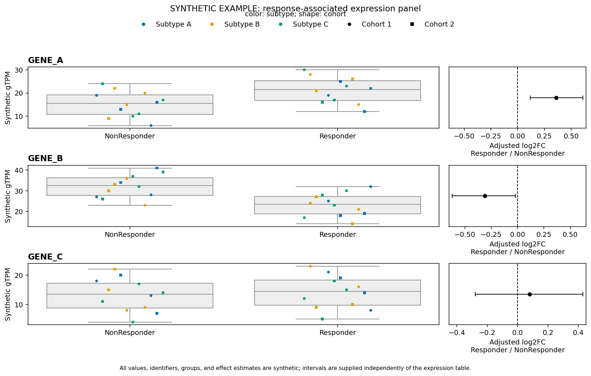

The expression table is long-form with one observation-feature row. The effect
table has exactly one row per feature. The renderer aligns the tables by feature
identifier but deliberately performs no statistical estimation. Subtype controls
point color, cohort controls marker shape, and both mappings share one legend
above the panels. In the bundled fixture, response group, subtype, and cohort are
sample-level annotations repeated consistently across every feature row.

## `barh_l2fc_dotplot_column`

This is the main composite plotting helper used in the example workflow.

### Full signature

```python
def barh_l2fc_dotplot_column(
        # shared parameters
        adata: anndata.AnnData | None = None,
        layer: str | None = None,
        x_df: pd.DataFrame | None = None,
        var_df: pd.DataFrame | None = None,
        obs_df: pd.DataFrame | None = None,
        feature_list: list[str] | None = None, # index of adata
        feature_label_vars_col: str | None = None, # if None than adata index used to label
        feature_label_char_limit: int | None = 40,
        feature_label_x: float = -0.02,
        figsize: tuple[int, int]| None = (10, 15),
        fig_title: str | None = None,
        fig_title_y: float = 1.03,
        subfig_title_y: float = 99,
        fig_title_fontsize: int | None = 30,
        subfig_title_fontsize: int | None = 24,
        feature_label_fontsize: int | None= 24,
        tick_label_fontsize: int | None= 20,
        legend_fontsize: int | None= 24,
        row_hspace: float | None = None,
        col_wspace: float | None = 0.07,
        bar2dotplot_width_ratios: list[float] | None = [1.5, 1.],
        tight_layout_rect_arg: list[float] | None = [0, 0, 1, 1],
        use_tight_layout: bool = True,
        savefig: bool = False,
        file_name: str = 'test_plot.png',
        # barh specific parameters
        comparison_col: str | None = 'Treatment',
        comparison_order: list[str] | None = None,
        hue_palette_color_list: list[str] | None = None,
        barh_remove_yticklabels: bool = True,
        barh_figure_plot_title: str | None = f'Expression (TPM)',
        barh_subplot_xlabel: str | None = 'Expression (TPM)',
        barh_sharex: bool = False,
        barh_set_xaxis_lims: tuple[int, int]| None = None,
        barh_legend: bool = True,
        barh_legend_bbox_to_anchor: tuple[int, int] | None = (0.5, -.05),

        # dotplot specific parameters
        dotplot_figure_plot_title: str | None = 'log2fc',
        dotplot_pval_vars_col_label: str | None = 'pvalue',
        dotplot_l2fc_vars_col_label: str | None ='log2FoldChange',
        dotplot_subplot_xlabel: str | None = 'log2fc ((target)/(ref))',
        pval_label: str = 'p-value',
        l2fc_label: str = 'log2FoldChange',
        pvalue_cutoff_ring: float = 0.1,
        sizes: tuple[int, int] | None = (20, 2000),
        dotplot_sharex: bool = False,
        dotplot_set_xaxis_lims: tuple[int, int]| None = None,
        dotplot_legend: bool = True,
        dotplot_legend_bins: int | None = 4,
        dotplot_legend_bbox_to_anchor: tuple[int, int] | None = (0.5, -.05),
        # Optional annotation on the dotplot with l2fc and p-value
        dotplot_annotate: bool = False,
        dotplot_annotate_xy: tuple[float, float] | None = (0.8, 1.2),
        dotplot_annotate_labels: tuple[str, str] | None = ('l2fc: ', 'p:'),
        dotplot_annotate_fontsize: int | None = None,
        distribution_kind: str = "bar",
        include_stripplot: bool = True,
        point_color_column: str | None = None,
        point_shape_column: str | None = None,
        point_palette: dict | None = None,
        point_markers: dict | None = None,
        point_jitter: float | None = None,
        point_size: float | None = None,
        #
        ):
```

```python
fig, subfigs = adtl.barh_l2fc_dotplot_column(
    adata=adata,
    layer="pgml",
    feature_list=feature_list,
    comparison_col="Treatment",
    dotplot_pval_vars_col_label="FDR",
    dotplot_l2fc_vars_col_label="log2FoldChange",
    savefig=True,
    file_name="results/barh_l2fc_dotplot.png",
)
```

### Gallery example

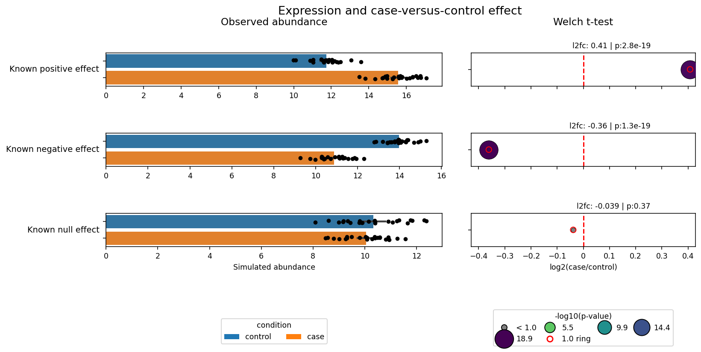

*`two_panel` — Expression and differential effect. [Data and analysis provenance](plotting_gallery.md#data-and-analysis-provenance).*

### Layout

- left subfigure: grouped horizontal bars with optional stripplot overlay
- right subfigure: one-feature-per-row log2 fold-change dotplots

### Important behavior

- Returns `(fig, subfigs)`.
- Supports either `adata` or explicit `x_df` plus `obs_df` plus `var_df`.
- `hue_palette_color_list` overrides the category colors for the bar panel.
- `distribution_kind="box"` or `"violin"` replaces the horizontal bar layer;
  `include_stripplot` controls the observation overlay independently.
- Optional `point_color_column` and `point_shape_column` values are read from
  `adata.obs` or `obs_df` and apply only to observation points.
- Dotplots derive marker color and size from `-log10(p)` and draw a red ring at the cutoff.
- Legends for the bar and dot panels are controlled separately.

This is the function called by `example_PMID_33969320/scripts/make_diff_datapoint_plots.py`.

## Advanced composite variants

The remaining functions extend the same pattern by adding more dotplot columns:

- `barh_dotplot_dotplot_column`: bar column plus two dotplot columns
- `barh_dotplot_dotplot_dotplot_column`: bar column plus three dotplot columns
- `barh_4X_dotplot_column`: bar column plus four dotplot columns

### Full signatures

```python
def barh_dotplot_dotplot_column(
        # shared parameters
        adata: anndata.AnnData | None = None,
        layer: str | None = None,
        x_df: pd.DataFrame | None = None,
        var_df: pd.DataFrame | None = None,
        obs_df: pd.DataFrame | None = None,
        feature_list: list[str] | None = None,
        feature_label_vars_col: str | None = None,
        feature_label_char_limit: int | None = 40,
        feature_label_x: float = -0.02,
        figsize: tuple[int, int] | None = (14, 15),
        fig_title: str | None = None,
        fig_title_y: float = 1.03,
        subfig_title_y: float = 0.99,
        fig_title_fontsize: int | None = 30,
        subfig_title_fontsize: int | None = 24,
        feature_label_fontsize: int | None = 24,
        tick_label_fontsize: int | None = 20,
        legend_fontsize: int | None = 24,
        row_hspace: float | None = None,
        col_wspace: float | None = 0.07,
        bar_dotplot_width_ratios: list[float] | None = [1.5, 1.0, 1.0],
        tight_layout_rect_arg: list[float] | None = [0, 0, 1, 1], # [left, bottom, right, top]
        use_tight_layout: bool = True,
        savefig: bool = False,
        file_name: str = 'barh_dotplot_dotplot.png',
        # barh specific parameters
        comparison_col: str | None = 'Treatment',
        comparison_order: list[str] | None = None,
        hue_palette_color_list: list[str] | None = None,
        barh_remove_yticklabels: bool = True,
        barh_figure_plot_title: str | None = 'Expression (TPM)',
        barh_subplot_xlabel: str | None = 'Expression (TPM)',
        barh_sharex: bool = False,
        barh_set_xaxis_lims: tuple[int, int] | None = None,
        barh_legend: bool = True,
        barh_legend_bbox_to_anchor: tuple[int, int] | None = (0.5, -.05),
        # dotplot1 parameters (match barh_l2fc_dotplot_column)
        dotplot_figure_plot_title: str | None = 'log2fc',
        dotplot_pval_vars_col_label: str | None = 'pvalue',
        dotplot_l2fc_vars_col_label: str | None = 'log2FoldChange',
        dotplot_subplot_xlabel: str | None = 'log2fc ((target)/(ref))',
        pval_label: str = 'p-value',
        pvalue_cutoff_ring: float = 0.1,
        sizes: tuple[int, int] | None = (20, 2000),
        dotplot_sharex: bool = False,
        dotplot_set_xaxis_lims: tuple[int, int] | None = None,
        dotplot_legend: bool = True,
        dotplot_legend_bins: int | None = 4,
        dotplot_legend_bbox_to_anchor: tuple[int, int] | None = (0.5, -.05),
        dotplot_annotate: bool = False,
        dotplot_annotate_xy: tuple[float, float] | None = (0.8, 1.2),
        dotplot_annotate_labels: tuple[str, str] | None = ('l2fc: ', 'p:'),
        dotplot_annotate_fontsize: int | None = None,
        # dotplot2 parameters (alt)
        dotplot2_figure_plot_title: str | None = 'log2fc (2)',
        dotplot2_pval_vars_col_label: str | None = 'pvalue_alt',
        dotplot2_l2fc_vars_col_label: str | None = 'log2FoldChange_alt',
        dotplot2_subplot_xlabel: str | None = 'log2fc ((target)/(ref))',
        dotplot2_pval_label: str = 'p-value',
        dotplot2_pvalue_cutoff_ring: float = 0.1,
        dotplot2_sizes: tuple[int, int] | None = (20, 2000),
        dotplot2_sharex: bool = False,
        dotplot2_set_xaxis_lims: tuple[int, int] | None = None,
        dotplot2_legend: bool = True,
        dotplot2_legend_bins: int | None = 4,
        dotplot2_legend_bbox_to_anchor: tuple[int, int] | None = (0.5, -.05),
        dotplot2_annotate: bool = False,
        dotplot2_annotate_xy: tuple[float, float] | None = (0.8, 1.2),
        dotplot2_annotate_labels: tuple[str, str] | None = ('l2fc: ', 'p:'),
        dotplot2_annotate_fontsize: int | None = None,
        distribution_kind: str = "bar",
        include_stripplot: bool = True,
        point_color_column: str | None = None,
        point_shape_column: str | None = None,
        point_palette: dict | None = None,
        point_markers: dict | None = None,
        point_jitter: float | None = None,
        point_size: float | None = None,
        ):
```

```python
def barh_dotplot_dotplot_dotplot_column(
        adata: anndata.AnnData | None = None,
        layer: str | None = None,
        x_df: pd.DataFrame | None = None,
        var_df: pd.DataFrame | None = None,
        obs_df: pd.DataFrame | None = None,
        feature_list: list[str] | None = None,
        feature_label_vars_col: str | None = None,
        feature_label_char_limit: int | None = 40,
        feature_label_x: float = -0.02,
        figsize: tuple[int, int] | None = (20, 25),
        fig_title: str | None = None,
        fig_title_y: float = 1.0,
        subfig_title_y: float = 0.94,
        fig_title_fontsize: int | None = 30,
        subfig_title_fontsize: int | None = 24,
        feature_label_fontsize: int | None = 24,
        tick_label_fontsize: int | None = 16,
        legend_fontsize: int | None = 20,
        row_hspace: float | None = None,
        col_wspace: float | None = 0.07,
        bar_dotplot_width_ratios: list[float] | None = [1.5, 1.0, 1.0, 1.0],
        tight_layout_rect_arg: list[float] | None = [0, 0, 1, 1],
        use_tight_layout: bool = True,
        savefig: bool = False,
        file_name: str = 'barh_dotplot_dotplot_dotplot.png',
        # barh
        comparison_col: str | None = 'Treatment',
        comparison_order: list[str] | None = None,
        hue_palette_color_list: list[str] | None = None,
        barh_remove_yticklabels: bool = True,
        barh_figure_plot_title: str | None = 'Expression',
        barh_subplot_xlabel: str | None = 'Expression',
        barh_sharex: bool = False,
        barh_set_xaxis_lims: tuple[int, int] | None = None,
        barh_legend: bool = True,
        barh_legend_bbox_to_anchor: tuple[int, int] | None = (0.5, -.05),
        # dotplot1
        dotplot_figure_plot_title: str | None = 'log2fc',
        dotplot_pval_vars_col_label: str | None = 'pvalue',
        dotplot_l2fc_vars_col_label: str | None = 'log2FoldChange',
        dotplot_subplot_xlabel: str | None = 'log2fc ((target)/(ref))',
        pval_label: str = 'p-value',
        pvalue_cutoff_ring: float = 0.1,
        sizes: tuple[int, int] | None = (20, 2000),
        dotplot_sharex: bool = False,
        dotplot_set_xaxis_lims: tuple[int, int] | None = None,
        dotplot_legend: bool = True,
        dotplot_legend_bins: int | None = 4,
        dotplot_legend_bbox_to_anchor: tuple[int, int] | None = (0.5, -.05),
        dotplot_annotate: bool = False,
        dotplot_annotate_xy: tuple[float, float] | None = (0.8, 1.2),
        dotplot_annotate_labels: tuple[str, str] | None = ('l2fc: ', 'p:'),
        dotplot_annotate_fontsize: int | None = None,
        # dotplot2
        dotplot2_figure_plot_title: str | None = 'log2fc (2)',
        dotplot2_pval_vars_col_label: str | None = 'pvalue_alt',
        dotplot2_l2fc_vars_col_label: str | None = 'log2FoldChange_alt',
        dotplot2_subplot_xlabel: str | None = 'log2fc ((target)/(ref))',
        dotplot2_pval_label: str = 'p-value',
        dotplot2_pvalue_cutoff_ring: float = 0.1,
        dotplot2_sizes: tuple[int, int] | None = (20, 2000),
        dotplot2_sharex: bool = False,
        dotplot2_set_xaxis_lims: tuple[int, int] | None = None,
        dotplot2_legend: bool = True,
        dotplot2_legend_bins: int | None = 4,
        dotplot2_legend_bbox_to_anchor: tuple[int, int] | None = (0.5, -.05),
        dotplot2_annotate: bool = False,
        dotplot2_annotate_xy: tuple[float, float] | None = (0.8, 1.2),
        dotplot2_annotate_labels: tuple[str, str] | None = ('l2fc: ', 'p:'),
        dotplot2_annotate_fontsize: int | None = None,
        # dotplot3
        dotplot3_figure_plot_title: str | None = 'log2fc (3)',
        dotplot3_pval_vars_col_label: str | None = 'pvalue_alt2',
        dotplot3_l2fc_vars_col_label: str | None = 'log2FoldChange_alt2',
        dotplot3_subplot_xlabel: str | None = 'log2fc ((target)/(ref))',
        dotplot3_pval_label: str = 'p-value',
        dotplot3_pvalue_cutoff_ring: float = 0.1,
        dotplot3_sizes: tuple[int, int] | None = (20, 2000),
        dotplot3_sharex: bool = False,
        dotplot3_set_xaxis_lims: tuple[int, int] | None = None,
        dotplot3_legend: bool = True,
        dotplot3_legend_bins: int | None = 4,
        dotplot3_legend_bbox_to_anchor: tuple[int, int] | None = (0.5, -.05),
        dotplot3_annotate: bool = False,
        dotplot3_annotate_xy: tuple[float, float] | None = (0.8, 1.2),
        dotplot3_annotate_labels: tuple[str, str] | None = ('l2fc: ', 'p:'),
        dotplot3_annotate_fontsize: int | None = None,
        distribution_kind: str = "bar",
        include_stripplot: bool = True,
        point_color_column: str | None = None,
        point_shape_column: str | None = None,
        point_palette: dict | None = None,
        point_markers: dict | None = None,
        point_jitter: float | None = None,
        point_size: float | None = None,
    ):
```

```python
def barh_4X_dotplot_column(
        adata: anndata.AnnData | None = None,
        layer: str | None = None,
        x_df: pd.DataFrame | None = None,
        var_df: pd.DataFrame | None = None,
        obs_df: pd.DataFrame | None = None,
        feature_list: list[str] | None = None,
        feature_label_vars_col: str | None = None,
        feature_label_char_limit: int | None = 40,
        feature_label_x: float = -0.02,
        figsize: tuple[int, int] | None = (22, 25),
        fig_title: str | None = None,
        fig_title_y: float = 1.0,
        subfig_title_y: float = 0.94,
        fig_title_fontsize: int | None = 30,
        subfig_title_fontsize: int | None = 24,
        feature_label_fontsize: int | None = 24,
        tick_label_fontsize: int | None = 16,
        legend_fontsize: int | None = 20,
        row_hspace: float | None = None,
        col_wspace: float | None = 0.07,
        bar_dotplot_width_ratios: list[float] | None = [1.5, 1.0, 1.0, 1.0, 1.0],
        tight_layout_rect_arg: list[float] | None = [0, 0, 1, 1],
        use_tight_layout: bool = True,
        savefig: bool = False,
        file_name: str = 'barh_4X_dotplot.png',
        # barh
        comparison_col: str | None = 'Treatment',
        comparison_order: list[str] | None = None,
        hue_palette_color_list: list[str] | None = None,
        barh_remove_yticklabels: bool = True,
        barh_figure_plot_title: str | None = 'Expression',
        barh_subplot_xlabel: str | None = 'Expression',
        barh_sharex: bool = False,
        barh_set_xaxis_lims: tuple[int, int] | None = None,
        barh_legend: bool = True,
        barh_legend_bbox_to_anchor: tuple[int, int] | None = (0.5, -.05),
        # dotplot1
        dotplot_figure_plot_title: str | None = 'log2fc',
        dotplot_pval_vars_col_label: str | None = 'pvalue',
        dotplot_l2fc_vars_col_label: str | None = 'log2FoldChange',
        dotplot_subplot_xlabel: str | None = 'log2fc ((target)/(ref))',
        pval_label: str = 'p-value',
        pvalue_cutoff_ring: float = 0.1,
        sizes: tuple[int, int] | None = (20, 2000),
        dotplot_sharex: bool = False,
        dotplot_set_xaxis_lims: tuple[int, int] | None = None,
        dotplot_legend: bool = True,
        dotplot_legend_bins: int | None = 4,
        dotplot_legend_bbox_to_anchor: tuple[int, int] | None = (0.5, -.05),
        dotplot_annotate: bool = False,
        dotplot_annotate_xy: tuple[float, float] | None = (0.8, 1.2),
        dotplot_annotate_labels: tuple[str, str] | None = ('l2fc: ', 'p:'),
        dotplot_annotate_fontsize: int | None = None,
        # dotplot2
        dotplot2_figure_plot_title: str | None = 'log2fc (2)',
        dotplot2_pval_vars_col_label: str | None = 'pvalue_alt',
        dotplot2_l2fc_vars_col_label: str | None = 'log2FoldChange_alt',
        dotplot2_subplot_xlabel: str | None = 'log2fc ((target)/(ref))',
        dotplot2_pval_label: str = 'p-value',
        dotplot2_pvalue_cutoff_ring: float = 0.1,
        dotplot2_sizes: tuple[int, int] | None = (20, 2000),
        dotplot2_sharex: bool = False,
        dotplot2_set_xaxis_lims: tuple[int, int] | None = None,
        dotplot2_legend: bool = True,
        dotplot2_legend_bins: int | None = 4,
        dotplot2_legend_bbox_to_anchor: tuple[int, int] | None = (0.5, -.05),
        dotplot2_annotate: bool = False,
        dotplot2_annotate_xy: tuple[float, float] | None = (0.8, 1.2),
        dotplot2_annotate_labels: tuple[str, str] | None = ('l2fc: ', 'p:'),
        dotplot2_annotate_fontsize: int | None = None,
        # dotplot3
        dotplot3_figure_plot_title: str | None = 'log2fc (3)',
        dotplot3_pval_vars_col_label: str | None = 'pvalue_alt2',
        dotplot3_l2fc_vars_col_label: str | None = 'log2FoldChange_alt2',
        dotplot3_subplot_xlabel: str | None = 'log2fc ((target)/(ref))',
        dotplot3_pval_label: str = 'p-value',
        dotplot3_pvalue_cutoff_ring: float = 0.1,
        dotplot3_sizes: tuple[int, int] | None = (20, 2000),
        dotplot3_sharex: bool = False,
        dotplot3_set_xaxis_lims: tuple[int, int] | None = None,
        dotplot3_legend: bool = True,
        dotplot3_legend_bins: int | None = 4,
        dotplot3_legend_bbox_to_anchor: tuple[int, int] | None = (0.5, -.05),
        dotplot3_annotate: bool = False,
        dotplot3_annotate_xy: tuple[float, float] | None = (0.8, 1.2),
        dotplot3_annotate_labels: tuple[str, str] | None = ('l2fc: ', 'p:'),
        dotplot3_annotate_fontsize: int | None = None,
        # dotplot4
        dotplot4_figure_plot_title: str | None = 'log2fc (4)',
        dotplot4_pval_vars_col_label: str | None = 'pvalue_alt3',
        dotplot4_l2fc_vars_col_label: str | None = 'log2FoldChange_alt3',
        dotplot4_subplot_xlabel: str | None = 'log2fc ((target)/(ref))',
        dotplot4_pval_label: str = 'p-value',
        dotplot4_pvalue_cutoff_ring: float = 0.1,
        dotplot4_sizes: tuple[int, int] | None = (20, 2000),
        dotplot4_sharex: bool = False,
        dotplot4_set_xaxis_lims: tuple[int, int] | None = None,
        dotplot4_legend: bool = True,
        dotplot4_legend_bins: int | None = 4,
        dotplot4_legend_bbox_to_anchor: tuple[int, int] | None = (0.5, -.05),
        dotplot4_annotate: bool = False,
        dotplot4_annotate_xy: tuple[float, float] | None = (0.8, 1.2),
        dotplot4_annotate_labels: tuple[str, str] | None = ('l2fc: ', 'p:'),
        dotplot4_annotate_fontsize: int | None = None,
        use_single_dotplot_colormap: bool = False,
        distribution_kind: str = "bar",
        include_stripplot: bool = True,
        point_color_column: str | None = None,
        point_shape_column: str | None = None,
        point_palette: dict | None = None,
        point_markers: dict | None = None,
        point_jitter: float | None = None,
        point_size: float | None = None,
    ):
```

### Gallery examples

#### `barh_dotplot_dotplot_column`

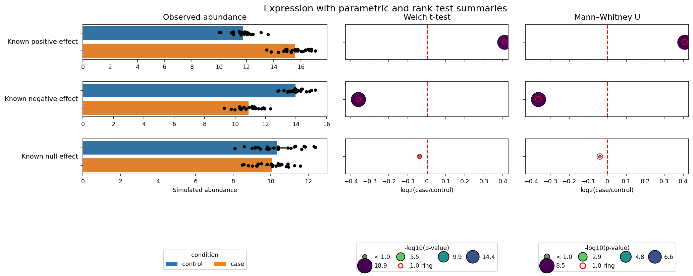

*`three_panel` — Expression with two differential summaries. [Data and analysis provenance](plotting_gallery.md#data-and-analysis-provenance).*

#### `barh_dotplot_dotplot_dotplot_column`

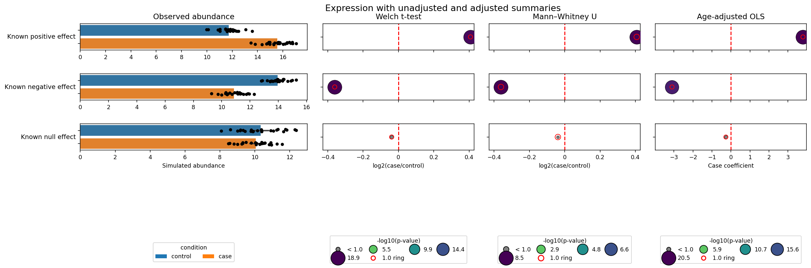

*`four_panel` — Expression with three differential summaries. [Data and analysis provenance](plotting_gallery.md#data-and-analysis-provenance).*

#### `barh_4X_dotplot_column`

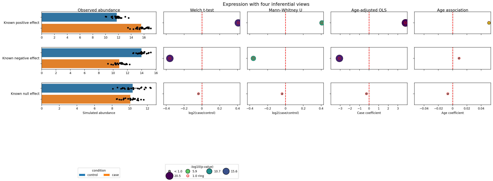

*`five_panel` — Expression with four inferential summaries. [Data and analysis provenance](plotting_gallery.md#data-and-analysis-provenance).*

Each added dotplot column gets its own parameter family:

- `dotplot2_*`
- `dotplot3_*`
- `dotplot4_*` for `barh_4X_dotplot_column`

Important behavior:

- These functions still return `(fig, subfigs)`.
- Their left distribution column accepts the same `distribution_kind`,
  `include_stripplot`, and observation color/shape parameters as
  `barh_l2fc_dotplot_column`.
- Every added dotplot panel requires its own `*_pval_vars_col_label` and `*_l2fc_vars_col_label`.
- `hue_palette_color_list` must provide at least one color per `comparison_col` category when used.
- These layouts are best treated as configuration-heavy report builders rather than small convenience wrappers.

## Common caveats

- Many functions call `plt.show()` internally.
- `savefig=True` writes the figure with `plt.savefig(...)`.
- Missing required features raise early `KeyError` or `ValueError`.
- Direct renderer regression coverage is in `tests/test_column_plot_renderers.py`; the gallery integration checks are in `tests/test_plotting_gallery.py`.
