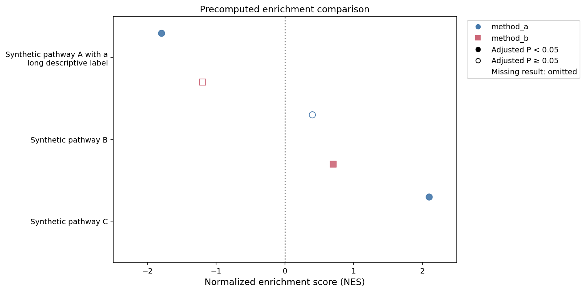
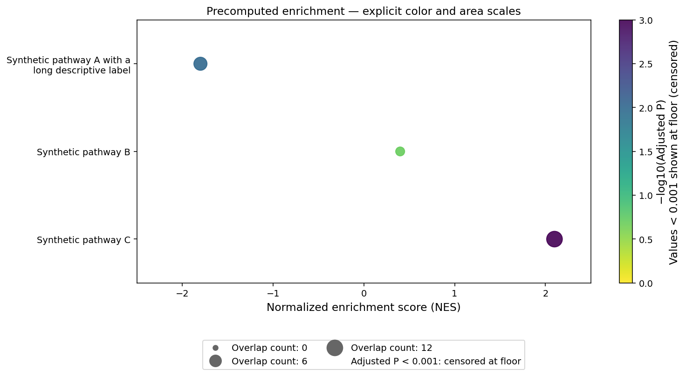

# Precomputed enrichment plots

`enrichment_dotplot` renders supplied results without running enrichment,
statistical tests, or fitting. Existing fold-change plot APIs are unchanged.
It returns `(fig, ax, plotted)` and is exported at the package root.

## `enrichment_dotplot`

```python
def enrichment_dotplot(
    table: pd.DataFrame,
    *,
    term: str,
    score: str | None = None,
    significance: str | None = None,
    comparison: str | None = None,
    term_label: str | None = None,
    term_order: Sequence[Any] | None = None,
    comparison_order: Sequence[Any] | None = None,
    mode: Literal["comparison", "bubble"] = "comparison",
    significance_cutoff: float = 0.05,
    score_label: str = "Normalized enrichment score (NES)",
    significance_label: str = "Adjusted P",
    palette: Mapping[Any, Any] | Sequence[Any] | str | None = None,
    point_size: float = 70,
    point_alpha: float = 0.9,
    x: str | None = None,
    color: str | None = None,
    area: str | None = None,
    color_label: str | None = None,
    area_label: str | None = None,
    color_transform: Literal["identity", "neglog10"] = "identity",
    color_floor: float | None = None,
    color_norm: mcolors.Normalize | None = None,
    area_norm: mcolors.Normalize | None = None,
    area_range: tuple[float, float] = (30, 300),
    cmap: str = "viridis_r",
    colorbar: bool = True,
    xlabel: str | None = None,
    ylabel: str | None = None,
    xlims: Sequence[float] | None = None,
    title: str | None = None,
    label_wrap: int | None = 40,
    axis_label_fontsize: float = 12,
    tick_fontsize: float = 10,
    legend: bool = True,
    legend_kwargs: Mapping[str, Any] | None = None,
    ax: plt.Axes | None = None,
    figsize: tuple[float, float] = (8, 6),
    show: bool = True,
    savefig: bool = False,
    file_name: str = "enrichment_dotplot.png",
) -> tuple[plt.Figure, plt.Axes, pd.DataFrame]:
```

## Grouped comparison

This runnable example uses synthetic values, including an empirical zero,
a value exactly at the significance cutoff, and a missing term/comparison pair.

```python
import pandas as pd
import adata_science_tools as adtl

enrichment = pd.DataFrame({
    "term_id": ["term_a", "term_b", "term_c", "term_a", "term_b"],
    "comparison": ["method_a", "method_a", "method_a", "method_b", "method_b"],
    "nes": [-1.8, 0.4, 2.1, -1.2, 0.7],
    "adjusted_p": [0.01, 0.20, 0.0, 0.05, 0.03],
    "overlap_count": [8, 3, 12, 6, 4],
})
enrichment["display_label"] = enrichment["term_id"].map({
    "term_a": "Synthetic pathway A with a long descriptive label",
    "term_b": "Synthetic pathway B",
    "term_c": "Synthetic pathway C",
})
fig, ax, plotted = adtl.enrichment_dotplot(
    enrichment, term="term_id", term_label="display_label",
    score="nes", significance="adjusted_p", comparison="comparison",
    term_order=["term_a", "term_b", "term_c"],
    comparison_order=["method_a", "method_b"],
    palette={"method_a": "#4477AA", "method_b": "#CC6677"},
    significance_cutoff=0.05, xlims=(-2.5, 2.5), label_wrap=28,
    legend_kwargs={"loc": "upper left", "bbox_to_anchor": (1.02, 1)},
    figsize=(11, 5.5), show=False,
)
```



Markers have constant area (`point_size`, in points squared). Comparisons use
color and shape, with shapes repeating after eight comparisons. Filled markers
mean `significance < significance_cutoff`; equality is open. The zero-score
reference does not transform the scores, and comparison mode takes no logarithm.
Use `score_label` and `significance_label` to name the supplied metrics accurately.

Stable `term` IDs determine alignment; `term_label` changes display text only.
Distinct IDs may share a label, but each ID must have a consistent label.
Term order runs from top to bottom. Explicit orders take precedence over
categorical dtype order and then first appearance. An explicit order must contain
all observed IDs; extra IDs reserve empty slots. Duplicate term/comparison keys
and missing IDs raise an error. Without `comparison`, each term must be unique.

Missing or infinite scores/significance omit the marker and retain its slot.
Unknown significance is never treated as nonsignificant. Finite significance
outside `[0, 1]` raises an error. Numeric inputs are required; ratio strings are
not parsed. No terms are automatically ranked, selected, or significance-filtered.

## Bubbles with explicit scales

This example continues from the synthetic table above. X, color, and area are
selected separately; no overlap denominator or biological meaning is inferred.

```python
from matplotlib.colors import Normalize

fig, ax, bubbles = adtl.enrichment_dotplot(
    enrichment.loc[enrichment["comparison"].eq("method_a")],
    term="term_id", term_label="display_label", mode="bubble",
    x="nes", color="adjusted_p", area="overlap_count",
    significance="adjusted_p",
    xlabel="Normalized enrichment score (NES)",
    color_label="Adjusted P", area_label="Overlap count",
    color_transform="neglog10", color_floor=0.001,
    color_norm=Normalize(0, 3, clip=True),
    area_norm=Normalize(0, 12, clip=True), area_range=(30, 300),
    label_wrap=28, figsize=(11, 6),
    legend_kwargs={"loc": "upper center", "bbox_to_anchor": (0.5, -0.2), "ncol": 2},
    show=False,
)
```



Use linear `matplotlib.colors.Normalize` objects with finite, fixed `vmin` and
`vmax`. They are copied, so plotting does not autoscale the caller's objects.
For comparable panels, supply the same bounds, `area_range`, colormap, and color
transform/floor to every call. Without supplied norms, color uses the rendered
minimum/maximum and area uses zero to the rendered maximum (zero to one for empty
or all-zero areas). These defaults are **per-call scales**; independently scaled
bubble sizes must not be compared across panels. A constant color range maps to
one color; a colorbar may expand that range for display.

Marker **area**, not radius, is
`area_range[0] + clip(area_norm(value), 0, 1) * (area_range[1] - area_range[0])`,
in points squared. Areas outside the supplied bounds are clipped. Color clipping
follows `color_norm.clip`; with clipping disabled, Matplotlib's under/over colors
apply. Negative finite area values are invalid. Missing/nonfinite x, color, or
area omits the marker. If `comparison` is supplied, offsets and marker shapes
identify comparisons while numeric color remains the selected color encoding.
Significance does not control fill in bubble mode; if supplied, its finite values
are still checked against `[0, 1]`.

`color_transform="identity"` displays the supplied numeric color values.
`"neglog10"` requires an explicit positive `color_floor` and nonnegative values.
Only display values use `-log10(max(value, color_floor))`; empirical zeros remain
zero in the source column. Values below the floor are flagged as censored and
identified in the legend and colorbar label. Choose a floor appropriate to the
upstream analysis; the plot does not infer a measurement limit.

## Returned data and figure controls

All original rows, values, index labels (including duplicates), and row order
remain in `plotted`; the input is unchanged. Added fields are:

| Field | Meaning |
| --- | --- |
| `source_position` | Zero-based source row position, disambiguating duplicate index labels. |
| `plot_x`, `plot_y` | Numeric score/x and term position including comparison offset. |
| `plot_status` | `plotted`, `nonfinite_score`, or `nonfinite_significance`; bubble mode additionally uses `nonfinite_color` and `nonfinite_area`. If several fail, x takes precedence, then significance (comparison) or color then area (bubble). |
| `marker_area` | Display area in points squared. |
| `color_value` | Bubble display value, after the optional explicit transform. |
| `color_censored` | Bubble source color is below the logarithmic floor. |
| `color_clipped`, `area_clipped` | Finite bubble values fall outside bounds and are clipped. |

Absent term/comparison records are listed separately in
`plotted.attrs["missing_combinations"]` as term/comparison dictionaries with
`plot_status="missing_result"`. They do not create fabricated source rows.
Attributes also record term/comparison order, the comparison palette/cutoff, or
bubble norms, area range, transform, and floor. Save these attributes separately
if exporting CSV, which does not retain DataFrame attributes. Input columns that
conflict with audit field names raise an error rather than being overwritten.

Empty tables render empty axes with requested term slots. `label_wrap` wraps
labels for display only; use `None` to disable wrapping. `axis_label_fontsize`,
`tick_fontsize`, and `legend_kwargs` control labels and legend placement, including
legend font size. `legend=False` and `colorbar=False` hide those elements.
`savefig=True, file_name="enrichment.png"` saves with a tight bounding box.

With `ax=None`, the function creates and lays out a figure; `show=False` closes
its GUI registration while the returned figure remains available for inspection
or saving. Supplied axes remain caller-owned: no show, close, or figure-wide
layout call occurs. A bubble colorbar, when enabled, occupies space beside the
supplied axes. No global plotting settings are changed.
