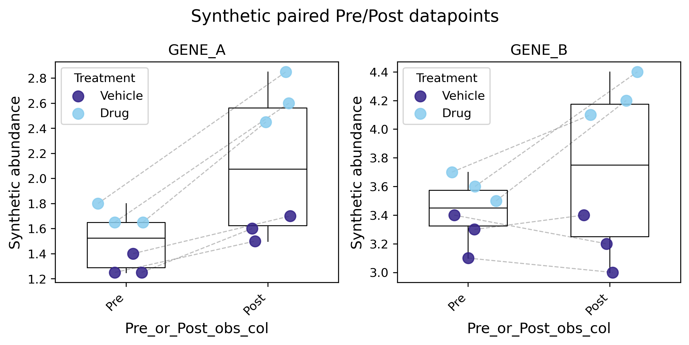

# `_paired_datapoints`

Paired datapoint plotting helpers from `_plotting/_plots.py`.

## Main entry point

1. `paired_datapoints`

## `paired_datapoints`

`paired_datapoints(...)` draws paired reference and target datapoints from
either an `AnnData` object or a wide `pandas.DataFrame`. It is intended for
Pre/Post, ref/target, and `ref_vs_target_adata()` source-value inspection.

The function builds a deterministic long-form plotting table first, then draws
one panel per selected variable or variable metadata group. It returns the
figure, axes, and that plotting table.

## Full signature

```python
def paired_datapoints(
    input_data: anndata.AnnData | pd.DataFrame | None = None,
    *,
    adata: anndata.AnnData | None = None,
    df: pd.DataFrame | None = None,
    var_df: pd.DataFrame | None = None,
    var_names: Sequence[str] | None = None,
    var_groupby_key: str | None = None,
    collapse_mode: Literal["stack", "aggregate", "all"] = "aggregate",
    collapse_func: Literal["mean", "median", "sum", "min", "max", "count", "select_max_ref_value"] = "mean",
    layer: str | None = None,
    use_raw: bool = False,
    groupby_key: str = "Pre_or_Post_obs_col",
    groupby_key_target_value: Any = "Post",
    groupby_key_ref_value: Any = "Pre",
    pair_by_key: str | None = None,
    subject_col: str = "Subject_ID",
    ref_values_obsm_key: str | None = None,
    target_values_obsm_key: str | None = None,
    filter_vars_by_isin_lists: Mapping[str, Sequence[Any]] | None = None,
    filter_obs_by_isin_lists: Mapping[str, Sequence[Any]] | None = None,
    subset_obs_key: str | None = None,
    subset_order: Sequence[Any] | None = None,
    palette: Sequence[Any] | str | None = palettes.tol_colors,
    subset_palette: Sequence[Any] | str | None = None,
    connect_lines: bool = True,
    line_alpha: float = 0.55,
    line_color: Any = "0.55",
    line_width: float = 0.9,
    line_style: str = "--",
    jitter_amount: float = 0.2,
    random_seed: int | None = 0,
    point_size: float = 80,
    point_alpha: float = 0.85,
    boxplot: bool = True,
    boxplot_width: float = 0.55,
    boxplot_showfliers: bool = False,
    ncols: int = 3,
    figsize: tuple[float, float] | None = None,
    sharey: bool = False,
    ylims: Sequence[float] | None = None,
    ylabel: str | None = None,
    title: str | None = None,
    subplot_title_var_col: str | None = None,
    title_fontsize: int = 14,
    axis_label_fontsize: int = 12,
    tick_label_fontsize: int | None = None,
    legend_fontsize: int | None = None,
    legend: bool = False,
    dropna: bool = True,
    nas2zeros: bool = False,
    dropzeros: bool = False,
    show: bool = True,
    savefig: bool = False,
    file_name: str = "paired_datapoints.png",
    logger: logging.Logger | None = None,
    log_level: int | str | None = None,
    allow_unused_params: bool = False,
    **params: Any,
) -> tuple[plt.Figure, dict[str, plt.Axes], pd.DataFrame]:
```

## Basic AnnData example

```python
import adata_science_tools as adtl

fig, axes, plot_df = adtl.paired_datapoints(
    adata=adata,
    var_names=["IL6"],
    groupby_key="Pre_or_Post_obs_col",
    groupby_key_ref_value="Pre",
    groupby_key_target_value="Post",
    pair_by_key="Subject_ID",
    subset_obs_key="Treatment",
    legend=True,
    show=False,
)
```

## Synthetic example plot

This example uses deterministic synthetic AnnData values with six paired
subjects, two treatment groups, and three protein variables grouped into two
genes.



```python
import anndata as ad
import numpy as np
import pandas as pd

import adata_science_tools as adtl

obs = pd.DataFrame(
    {
        "Pre_or_Post_obs_col": ["Pre", "Post"] * 6,
        "Subject_ID": ["S1", "S1", "S2", "S2", "S3", "S3", "S4", "S4", "S5", "S5", "S6", "S6"],
        "Treatment": pd.Categorical(
            ["Vehicle", "Vehicle", "Vehicle", "Vehicle", "Drug", "Drug", "Drug", "Drug", "Drug", "Drug", "Vehicle", "Vehicle"]
        ),
    },
    index=[f"s{i}_{side.lower()}" for i in range(1, 7) for side in ("Pre", "Post")],
)
var = pd.DataFrame(
    {
        "Gene": ["GENE_A", "GENE_A", "GENE_B"],
        "feature_type": ["protein", "protein", "protein"],
    },
    index=["GENE_A_v1", "GENE_A_v2", "GENE_B_v1"],
)
X = np.array(
    [
        [1.2, 1.6, 3.4],
        [1.5, 1.9, 3.2],
        [1.0, 1.5, 3.1],
        [1.4, 1.8, 3.0],
        [1.4, 1.9, 3.5],
        [2.3, 2.9, 4.2],
        [1.6, 2.0, 3.6],
        [2.6, 3.1, 4.4],
        [1.5, 1.8, 3.7],
        [2.2, 2.7, 4.1],
        [1.1, 1.4, 3.3],
        [1.3, 1.7, 3.4],
    ]
)
adata = ad.AnnData(X=X, obs=obs, var=var)

fig, axes, plot_df = adtl.paired_datapoints(
    adata=adata,
    var_groupby_key="Gene",
    var_names=["GENE_A", "GENE_B"],
    collapse_mode="aggregate",
    collapse_func="mean",
    pair_by_key="Subject_ID",
    subset_obs_key="Treatment",
    subset_order=["Vehicle", "Drug"],
    legend=True,
    title="Synthetic paired Pre/Post datapoints",
    ylabel="Synthetic abundance",
    random_seed=7,
    figsize=(8, 4),
    savefig=True,
    file_name="docs/assets/paired_datapoints_synthetic_example.png",
    show=False,
)
```

## Supported input modes

1. `adata=...` uses `.X`, `adata.layers[layer]`, or `adata.raw.X` when
   `use_raw=True`.

2. `df=...` or `input_data=<DataFrame>` expects rows to be observations and
   selected feature columns to contain the plotted values. Provide `var_names`
   or `var_df.index` so metadata columns are not guessed as features.

3. `input_data=<AnnData>` is accepted as a convenience for config-driven calls,
   but cannot be combined with explicit `adata=` or `df=`.

4. The alias `input=...` is accepted through `**params` for YAML/config
   compatibility when `input_data` is not supplied.

## Pairing behavior

1. The x-axis is ordered as reference then target, with labels from
   `groupby_key_ref_value` and `groupby_key_target_value`.

2. Pairing uses `pair_by_key` when provided, otherwise `subject_col`.

3. Duplicate pair IDs within either side raise `ValueError`.

4. Incomplete ref-only or target-only pairs are dropped and logged as warnings.

5. If no complete pairs remain, the function raises `ValueError`.

## `ref_vs_target_adata()` source values

1. For `ref_vs_target_adata()`-style outputs, the function defaults to plotting
   paired source values from `adata.obsm` when available.

2. Explicit `ref_values_obsm_key` and `target_values_obsm_key` take priority.

3. Without explicit keys, the function checks `adata.obsm["pre_values"]` and
   `adata.obsm["post_values"]`, then `adata.obsm["pre"]` and
   `adata.obsm["post"]`, then `adata.obsm["ref_values"]` and
   `adata.obsm["target_values"]`.

4. Source-value `obsm` entries may be `pandas.DataFrame` objects aligned by
   observation index and variable columns, or array-like values aligned to
   `adata.obs_names` and `adata.var_names`.

```python
post_minus_pre = adtl.ref_vs_target_adata(
    adata,
    pair_by_key="Subject_ID",
    save_source_values_obsm=True,
)

fig, axes, plot_df = adtl.paired_datapoints(
    adata=post_minus_pre,
    var_names=["IL6"],
    pair_by_key="Subject_ID",
    show=False,
)
```

## Filtering and subsets

1. `filter_obs_by_isin_lists={"column": ["allowed"]}` filters observations with
   AND semantics before pairing.

2. `filter_vars_by_isin_lists={"column": ["allowed"]}` filters variables with
   AND semantics before grouping and collapse.

3. `subset_obs_key="column"` colors points by observation metadata group within
   each panel.

4. `subset_order` controls hue order; otherwise categorical order or first
   appearance is used.

## Variable grouping and collapse

1. With `var_groupby_key=None`, `var_names` selects raw variable names.

2. With `var_groupby_key="column"`, `var_names` selects group names in variable
   metadata, matching `adata_histograms()`.

3. `collapse_mode="aggregate"` reduces each selected variable group to one
   value per pair side using `collapse_func`.

4. `collapse_mode="stack"` keeps raw variable-level values and includes
   `source_variable` in `plot_df`. Paired lines connect the same pair and raw
   variable where both ref and target values remain after filtering.

5. `collapse_mode="all"` stacks all selected raw variables into one panel named
   `"all"`.

6. `collapse_func="select_max_ref_value"` is AnnData-only, requires
   `var_groupby_key`, and selects the raw variable with the largest non-missing
   reference value per pair and group. Ties are logged and resolved by filtered
   variable order.

## Logging

The function uses `logging.getLogger(__name__)` by default. Pass `logger=...` to
route messages elsewhere, and pass `log_level=...` to set that logger's level
for this call. The function logs selected source-value `obsm` keys, dropped
incomplete pairs, stack-mode line behavior, and tied `select_max_ref_value`
choices.

## Return value

The return value is `(fig, axes, plot_df)`.

1. `fig` is the matplotlib figure.

2. `axes` is a dict keyed by panel name.

3. `plot_df` is the long-form plotting table with at least `panel`, `variable`,
   `source_variable`, `pair_id`, `x_label`, `x_order`, and `value`.

4. When `show=False`, the figure is closed before returning, matching the
   package's test-backed plotting APIs.
