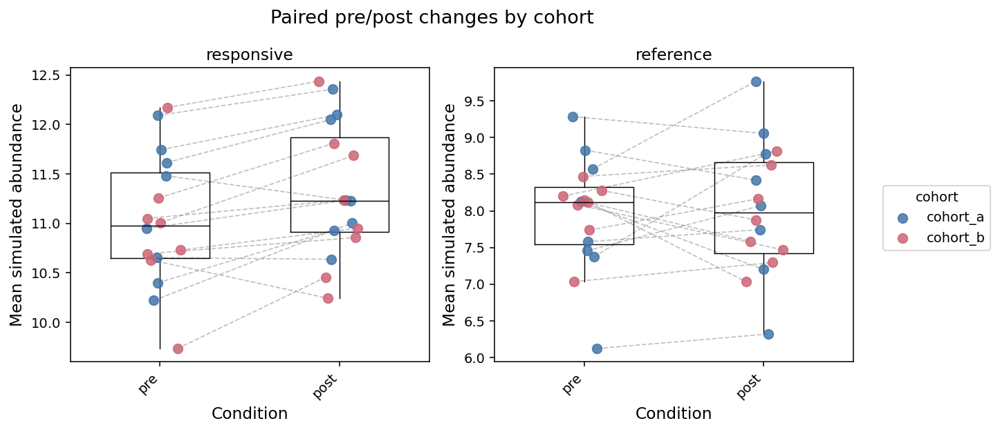
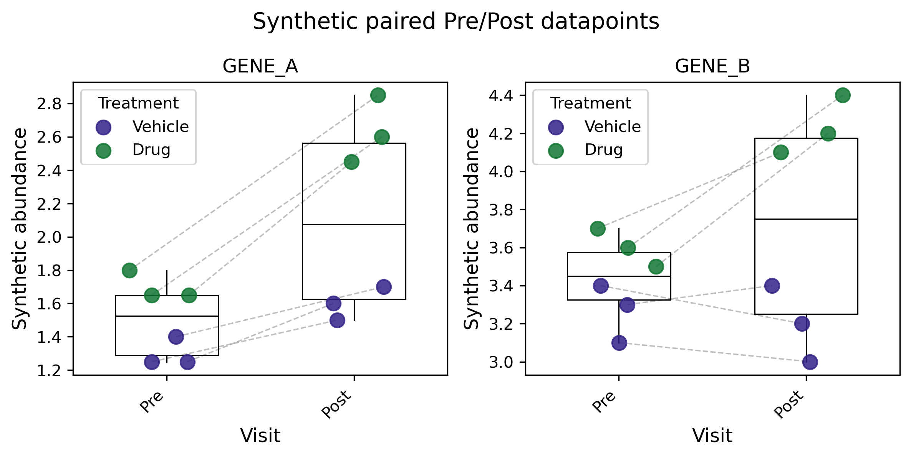
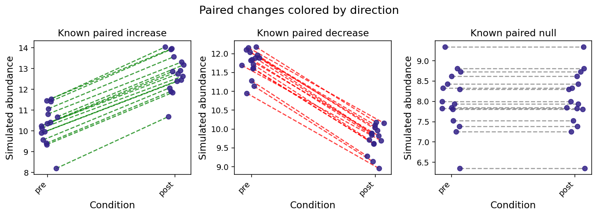
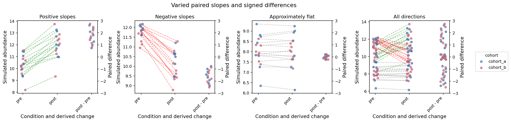
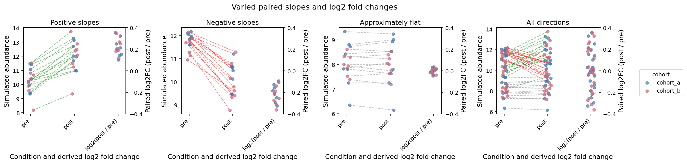
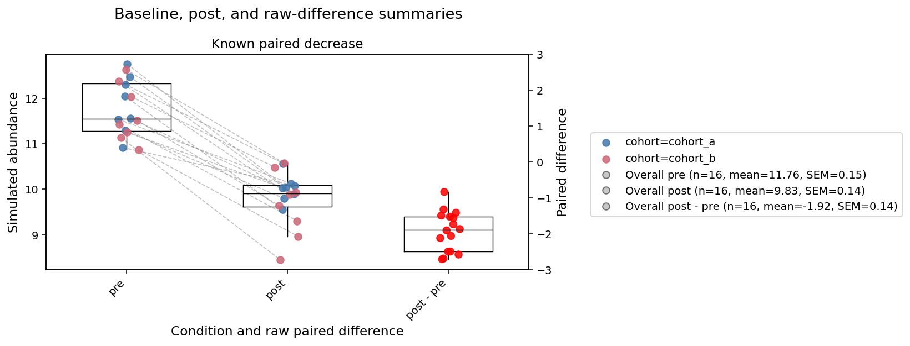
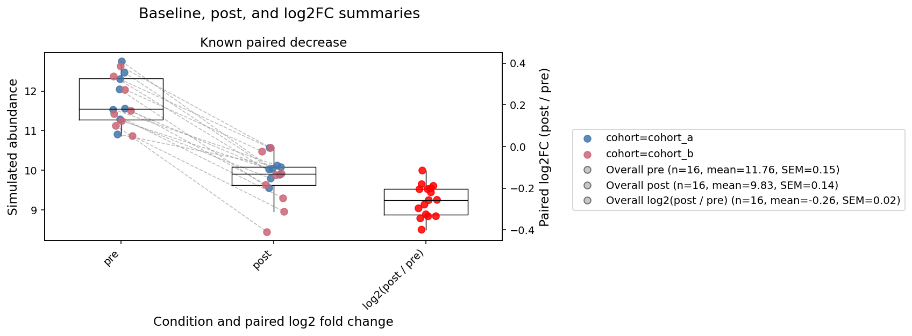
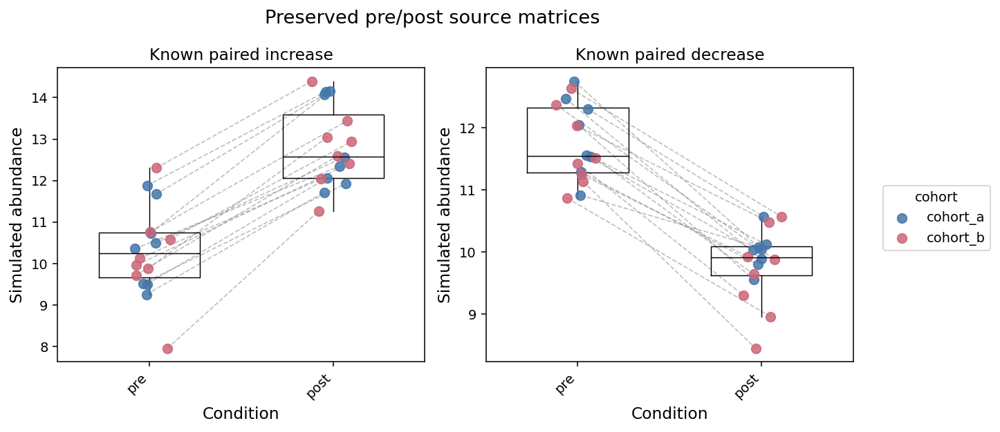

# `_paired_datapoints`

Paired datapoint plotting helpers from `_plotting/_datapoints.py`.

## Main entry point

1. `paired_datapoints`

## `paired_datapoints`

`paired_datapoints(...)` draws paired reference and target datapoints from
either an `AnnData` object or a wide `pandas.DataFrame`. It is intended for
Pre/Post, ref/target, and `ref_vs_target_adata()` source-value inspection.

The function builds a deterministic long-form plotting table first, then draws
one panel per selected variable or variable metadata group. It returns the
figure, axes, and that plotting table.

## Full signature

```python
def paired_datapoints(
    input_data: anndata.AnnData | pd.DataFrame | None = None,
    *,
    adata: anndata.AnnData | None = None,
    df: pd.DataFrame | None = None,
    var_df: pd.DataFrame | None = None,
    var_names: Sequence[str] | None = None,
    var_groupby_key: str | None = None,
    collapse_mode: Literal["stack", "aggregate", "all"] = "aggregate",
    collapse_func: Literal[
        "mean",
        "median",
        "sum",
        "min",
        "max",
        "count",
        "select_max_ref_value",
    ] = "mean",
    layer: str | None = None,
    use_raw: bool = False,
    groupby_key: str = "Pre_or_Post_obs_col",
    groupby_key_target_value: Any = "Post",
    groupby_key_ref_value: Any = "Pre",
    pair_by_key: str | None = None,
    subject_col: str = "Subject_ID",
    ref_values_obsm_key: str | None = None,
    target_values_obsm_key: str | None = None,
    target_min_value: float | None = None,
    target_max_value: float | None = None,
    ref_min_value: float | None = None,
    ref_max_value: float | None = None,
    bounds_fill_missing: bool = False,
    bounds_fill_missing_paired_only: bool = False,
    filter_vars_by_isin_lists: Mapping[str, Sequence[Any]] | None = None,
    filter_obs_by_isin_lists: Mapping[str, Sequence[Any]] | None = None,
    subplot_by_obs_key: str | None = None,
    subset_obs_key: str | None = None,
    subset_var_key: str | None = None,
    subset_order: Sequence[Any] | None = None,
    palette: Sequence[Any] | str | None = palettes.tol_colors,
    subset_palette: Sequence[Any] | str | None = None,
    point_color_by_side: bool = False,
    ref_point_color: Any = "tab:blue",
    target_point_color: Any = "tab:orange",
    connect_lines: bool = True,
    line_alpha: float = 0.55,
    line_color: Any = "0.55",
    line_color_by_slope: bool = False,
    slope_color_threshold: float = 0.05,
    negative_slope_color: Any = "red",
    positive_slope_color: Any = "green",
    flat_slope_color: Any = "gray",
    show_paired_difference: bool = False,
    paired_difference_mode: Literal["difference", "log2fc"] = "difference",
    paired_difference_color_by_sign: bool = True,
    paired_difference_label: str | None = None,
    paired_difference_ylabel: str | None = None,
    paired_difference_ylims: Sequence[float] | None = None,
    paired_difference_sharey: bool = True,
    line_width: float = 0.9,
    line_style: str = "--",
    jitter_amount: float = 0.2,
    random_seed: int | None = 0,
    point_size: float = 80,
    point_alpha: float = 0.85,
    boxplot: bool = True,
    boxplot_width: float = 0.55,
    boxplot_showfliers: bool = False,
    violinplot: bool = False,
    violin_width: float = 0.8,
    violin_alpha: float = 0.25,
    legend_metrics: Sequence[
        Literal["mean", "median", "count", "std", "sem"]
    ] | None = None,
    legend_metric_formats: Mapping[
        Literal["mean", "median", "count", "std", "sem"],
        str,
    ] | None = None,
    legend_summary_prefix: str | None = "Overall",
    legend_metric_separator: str = ", ",
    highlight_negative_summary_legend: bool = True,
    ncols: int = 3,
    figsize: tuple[float, float] | None = None,
    wspace: float | None = None,
    hspace: float | None = None,
    sharey: bool = False,
    ylims: Sequence[float] | None = None,
    ylabel: str | None = None,
    xlabel: str | None = None,
    title: str | None = None,
    title_axes_top: float | None = None,
    subplot_title_var_col: str | None = None,
    subplot_title_y: float | None = None,
    subplot_title_fontsize: int | None = None,
    title_fontsize: int = 14,
    title_y: float | None = None,
    axis_label_fontsize: int = 12,
    tick_label_fontsize: int | None = None,
    legend_fontsize: int | None = None,
    legend_loc: str | int | None = None,
    legend_bbox_to_anchor: tuple[float, ...] | None = None,
    legend_scope: Literal["axis", "figure"] = "axis",
    legend: bool = False,
    dropna: bool = True,
    nas2zeros: bool = False,
    dropzeros: bool = False,
    show: bool = True,
    savefig: bool = False,
    file_name: str = "paired_datapoints.png",
    logger: logging.Logger | None = None,
    log_level: int | str | None = None,
    allow_unused_params: bool = False,
    **params: Any,
) -> tuple[plt.Figure, dict[str, plt.Axes], pd.DataFrame]:
```

## Basic AnnData example

```python
import adata_science_tools as adtl

fig, axes, plot_df = adtl.paired_datapoints(
    adata=adata,
    var_names=["IL6"],
    groupby_key="Pre_or_Post_obs_col",
    groupby_key_ref_value="Pre",
    groupby_key_target_value="Post",
    pair_by_key="Subject_ID",
    subset_obs_key="Treatment",
    legend=True,
    show=False,
)
```



*`paired_groups` — Paired changes by treatment. [Data and analysis provenance](plotting_gallery.md#data-and-analysis-provenance).*

## Title and axis label placement

`title` sets the overall figure title and does not replace the selected feature
or variable-group subplot titles. `subplot_title_var_col` can instead source
single-variable subplot titles from variable metadata. Use `title_y` and
`subplot_title_y` to move the figure title or subplot titles vertically.
`title_fontsize` controls only the overall figure title, while
`subplot_title_fontsize` independently controls the subplot titles. Leaving
`subplot_title_fontsize=None` preserves the existing subplot title sizing. Use
`xlabel=""` to suppress the x-axis label below the Pre/Post tick labels.

Set `title_axes_top` to the normalized figure coordinate for the top edge of the
subplot area. Set `wspace` or `hspace` to reserve horizontal or vertical space
between subplots, including space for subplot-level external legends. After
`tight_layout()`, supplied values are applied together through
`fig.subplots_adjust()`; only the supplied `top`, `wspace`, or `hspace`
dimensions are overridden. These spacing controls do not change the requested
`figsize` or the figure aspect ratio. When all three are omitted,
`paired_datapoints()` retains its existing `tight_layout()` result.

```python
fig, axes, plot_df = adtl.paired_datapoints(
    adata=adata,
    var_names=["IL6"],
    pair_by_key="Subject_ID",
    title="Paired IL6",
    title_y=1.03,
    subplot_title_y=1.05,
    subplot_title_fontsize=11,
    title_fontsize=14,
    title_axes_top=0.76,
    wspace=0.35,
    hspace=0.4,
    xlabel="",
    show=False,
)
```

## Synthetic example plot

This example uses deterministic synthetic AnnData values with six paired
subjects, two treatment groups, and three protein variables grouped into two
genes.



```python
import anndata as ad
import numpy as np
import pandas as pd

import adata_science_tools as adtl

obs = pd.DataFrame(
    {
        "Pre_or_Post_obs_col": ["Pre", "Post"] * 6,
        "Subject_ID": ["S1", "S1", "S2", "S2", "S3", "S3", "S4", "S4", "S5", "S5", "S6", "S6"],
        "Treatment": pd.Categorical(
            ["Vehicle", "Vehicle", "Vehicle", "Vehicle", "Drug", "Drug", "Drug", "Drug", "Drug", "Drug", "Vehicle", "Vehicle"]
        ),
    },
    index=[f"s{i}_{side.lower()}" for i in range(1, 7) for side in ("Pre", "Post")],
)
var = pd.DataFrame(
    {
        "Gene": ["GENE_A", "GENE_A", "GENE_B"],
        "feature_type": ["protein", "protein", "protein"],
    },
    index=["GENE_A_v1", "GENE_A_v2", "GENE_B_v1"],
)
X = np.array(
    [
        [1.2, 1.6, 3.4],
        [1.5, 1.9, 3.2],
        [1.0, 1.5, 3.1],
        [1.4, 1.8, 3.0],
        [1.4, 1.9, 3.5],
        [2.3, 2.9, 4.2],
        [1.6, 2.0, 3.6],
        [2.6, 3.1, 4.4],
        [1.5, 1.8, 3.7],
        [2.2, 2.7, 4.1],
        [1.1, 1.4, 3.3],
        [1.3, 1.7, 3.4],
    ]
)
adata = ad.AnnData(X=X, obs=obs, var=var)

fig, axes, plot_df = adtl.paired_datapoints(
    adata=adata,
    var_groupby_key="Gene",
    var_names=["GENE_A", "GENE_B"],
    collapse_mode="aggregate",
    collapse_func="mean",
    pair_by_key="Subject_ID",
    subset_obs_key="Treatment",
    subset_order=["Vehicle", "Drug"],
    legend=True,
    title="Synthetic paired Pre/Post datapoints",
    ylabel="Synthetic abundance",
    random_seed=7,
    figsize=(8, 4),
    savefig=True,
    file_name="docs/assets/paired_datapoints_synthetic_example.png",
    show=False,
)
```

## Supported input modes

1. `adata=...` uses `.X`, `adata.layers[layer]`, or `adata.raw.X` when
   `use_raw=True`.

2. `df=...` or `input_data=<DataFrame>` expects rows to be observations and
   selected feature columns to contain the plotted values. Provide `var_names`
   or `var_df.index` so metadata columns are not guessed as features.

3. `input_data=<AnnData>` is accepted as a convenience for config-driven calls,
   but cannot be combined with explicit `adata=` or `df=`.

4. The alias `input=...` is accepted through `**params` for YAML/config
   compatibility when `input_data` is not supplied.

## Pairing behavior

1. The x-axis is ordered as reference then target, with labels from
   `groupby_key_ref_value` and `groupby_key_target_value`.

2. Pairing uses `pair_by_key` when provided, otherwise `subject_col`.

3. Duplicate pair IDs within either side raise `ValueError`.

4. Incomplete ref-only or target-only pairs are dropped and logged as warnings.

5. If no complete pairs remain, the function raises `ValueError`.

## Endpoint colors by side

The default `point_color_by_side=False` preserves the existing `palette` and
subset-hue coloring. Set `point_color_by_side=True` to color reference dots with
`ref_point_color` (default `"tab:blue"`) and target dots with `target_point_color`
(default `"tab:orange"`). Both accept Matplotlib color-like values, including
color names, hex strings, and RGB/RGBA tuples. The color arguments take effect
only in side mode; this switch does not enable legends.

Side colors override endpoint subset hues while preserving subset selection and
returned metadata. They are independent of connector colors and the sign colors
of paired-difference or log2FC dots. Obsolete endpoint subset legend entries are
suppressed. If `show_paired_difference=True` and
`paired_difference_color_by_sign=False`, subset-colored third-position dots
retain their hue entries, prefixed with the resolved difference/log2FC label.

This example combines side-colored endpoints, per-position summaries, and
sign-colored log2FC dots:

```python
fig, axes, plot_df = adtl.paired_datapoints(
    adata=adata,
    var_names=["IL6"],
    pair_by_key="Subject_ID",
    subset_obs_key="Treatment",
    point_color_by_side=True,
    ref_point_color="tab:blue",
    target_point_color="tab:orange",
    show_paired_difference=True,
    paired_difference_mode="log2fc",
    paired_difference_color_by_sign=True,
    legend=True,
    legend_metrics=("count", "mean", "median"),
    show=False,
)
```

## Slope-colored connecting lines

Set `line_color_by_slope=True` to color each complete connecting line with
finite endpoints from its symmetric average-magnitude normalized change:
`(target - reference) / ((abs(reference) + abs(target)) / 2)`. The absolute
magnitudes make the calculation safe for negative or opposite-sign endpoints,
and swapping the endpoints negates the change without altering its magnitude.
The calculation uses the displayed y values, not the jittered x positions.

Exact zero and values with
`abs(normalized_change) < slope_color_threshold` use `flat_slope_color`; values
exactly equal to the positive or negative threshold remain directional. The
default threshold `0.05` therefore means 5%, so a change from `100` to `99` is
approximately `-1.005%` and gray. A pair with both endpoints equal to zero is
flat. A pair with exactly one zero endpoint has a normalized change of `2` or
`-2`, so it is directional at the default threshold; thresholds greater than
`2` classify every finite symmetric change as flat. The default directional
colors are green for positive changes and red for negative changes, while
approximately flat lines are gray.

When slope coloring is disabled, `line_color` remains the uniform connector
color. When it is enabled, the three slope colors take precedence for finite
endpoints; a connector with a nonfinite endpoint retains `line_color`. Grouped
`collapse_mode="aggregate"` lines are classified from their displayed reduced
values; `collapse_mode="stack"` and `collapse_mode="all"` classify each pair and
source-variable line independently. Slope coloring does not add a legend.

```python
fig, axes, plot_df = adtl.paired_datapoints(
    adata=adata,
    var_names=["IL6"],
    pair_by_key="Subject_ID",
    line_color_by_slope=True,
    slope_color_threshold=0.05,
    show=False,
)
```



*`slope_colored_lines` — Deterministic positive, negative, and approximately-flat paired changes. [Data and analysis provenance](plotting_gallery.md#data-and-analysis-provenance).*

## Paired change axis

Set `show_paired_difference=True` to add a third x-axis position for signed
paired changes drawn against a secondary y-axis on the right. The default
`paired_difference_mode="difference"` computes each finite dot in the original
measurement units as `target - reference`. Set
`paired_difference_mode="log2fc"` to display
`log2(target / reference)`, so a Post value above its paired baseline produces
a positive log2 fold change. This is not the normalized relative change used
by `line_color_by_slope`.

The calculation occurs after bounds, optional missing-value filling, collapsing,
numeric coercion, and `nas2zeros`, but before `dropna` and `dropzeros`. The two
row-wise filters then apply independently to endpoint and derived-change rows:
`dropna=True` removes missing changes and `dropzeros=True` removes exact-zero
changes. In difference mode, a nonzero change can remain when a zero endpoint
is hidden. Consequently, `collapse_mode="aggregate"` calculates the selected
change from the two transformed aggregates, while `collapse_mode="stack"` and
`collapse_mode="all"` calculate one change per pair and source variable.
Nonfinite or unrepresentable changes do not produce visible dots.

Log2 fold changes require finite, strictly positive reference and target
values. Pairs containing zero, a negative value, or a nonfinite endpoint have
missing log2FC values and are counted in a warning; no pseudocount is added.
The calculation uses `log2(target) - log2(reference)` to avoid overflow from
forming the ratio directly.

Default third-tick and right-axis labels follow the selected mode. Difference
mode uses `<target label> - <reference label>` and `Paired difference`; log2FC
mode uses `log2(<target label> / <reference label>)` and
`Paired log2FC (<target label> / <reference label>)`. Explicit strings,
including empty strings, override those labels. `paired_difference_ylims` sets
explicit right-axis limits and must contain finite, increasing bounds symmetric
around zero. By default, every populated panel uses the same secondary limits;
without explicit limits, that shared scale is resolved symmetrically around
zero to span all displayed changes. Set `paired_difference_sharey=False` to
scale each panel's secondary axis independently while keeping every range
symmetric around zero. Explicit `paired_difference_ylims` takes precedence over
either automatic scaling mode. This option is independent of `sharey`, and
existing `ylims` continues to control only the primary reference/target axis.

By default, derived-change dots are colored by the exact sign of the displayed
value: `negative_slope_color` for values below zero, `positive_slope_color` for
values above zero, and `flat_slope_color` for exact zero. With the default
colors, these are red, green, and gray. This classification is independent of
`slope_color_threshold`, which applies only to connector lines; a small nonzero
change can therefore have an approximately-flat gray connector and a red or
green derived dot. Set `paired_difference_color_by_sign=False` to restore the
ordinary point or subset-hue styling for the third position. Endpoint color
settings are independent, and no separate sign legend is added.

Distribution overlays use the axis that owns each value. Boxplots are enabled
by default at the reference, target, and derived positions. Set
`violinplot=True` to add a violin behind each box and its points, or combine
`boxplot=False` with `violinplot=True` for violin-only output. The derived
boxplot or violin is drawn at x=3 against the secondary y-axis and uses the same
filtered difference or log2FC values as the dots. These overlays are not
connected to the target point because their y coordinates belong to the right
axis.

```python
fig, axes, plot_df = adtl.paired_datapoints(
    adata=adata,
    var_names=["IL6"],
    pair_by_key="Subject_ID",
    subset_obs_key="Treatment",
    show_paired_difference=True,
    paired_difference_label="Post - Pre",
    paired_difference_ylabel="Paired IL6 difference",
    line_color_by_slope=True,
    boxplot=True,
    show=False,
)
```



*`difference_axis` — Varied positive, negative, and approximately-flat slopes are shown separately and together, with sign-colored raw differences and boxplots on zero-centered symmetric secondary axes. [Data and analysis provenance](plotting_gallery.md#data-and-analysis-provenance).*

Use log2FC mode when proportional paired changes are more meaningful than raw
measurement-unit differences:

```python
fig, axes, plot_df = adtl.paired_datapoints(
    adata=adata,
    var_names=["IL6"],
    pair_by_key="Subject_ID",
    subset_obs_key="Treatment",
    show_paired_difference=True,
    paired_difference_mode="log2fc",
    line_color_by_slope=True,
    boxplot=False,
    violinplot=True,
    show=False,
)
```



*`log2fc_axis` — The same varied positive, negative, and approximately-flat slopes are shown separately and together, with sign-colored `log2(post / baseline)` values and violin overlays on zero-centered symmetric secondary axes. [Data and analysis provenance](plotting_gallery.md#data-and-analysis-provenance).*

## Per-position summary legends

Set `legend=True` and provide `legend_metrics` to add overall summary rows for
each displayed x-axis position. This feature is opt-in: the default
`legend_metrics=None` adds no summary rows. Supported metrics are `mean`,
`median`, `count`, `std`, and `sem`. They appear in the requested order, while
the summary rows follow the displayed x order:
reference, target, then the optional paired difference or log2FC.

Each summary uses the finite `value` rows that remain in its panel and x
position after bounds, missing-value handling, `dropna`, and `dropzeros` have
been applied. `count` is therefore the number of finite post-filter rows at
that position. These are overall summaries across subset hues, not separate
statistics for each subset.

Summary markers remain neutral by default. With `point_color_by_side=True`,
reference and target summary marker faces and edges match their respective side
colors. The difference/log2FC summary marker remains neutral. Marker colors do
not alter the negative-summary text highlighting described below.

`legend_metric_formats` optionally replaces the text for individual selected
metrics. Each format string may use only `{metric}` and `{value}`. Count values
are supplied as integers; means, medians, standard deviations, and standard
errors are supplied as floats. Metrics without an override use `count=N` or
`<metric>=<three-significant-digit value>`. Invalid metric names, format keys,
placeholders, or format specifications raise before drawing.

`legend_metric_separator` joins the rendered metrics within each summary row.
Its default `", "` preserves comma-separated labels. Set it to `"\n"` to place
each metric on its own line without adding newline characters to the individual
`legend_metric_formats` strings.

By default, `highlight_negative_summary_legend=True` renders an entire summary
row in red bold text when any displayed `mean` or `median` is less than zero.
The decision uses the exact finite summary value before label formatting, so a
custom format or rounded display cannot change the classification. `count`,
`std`, and `sem` do not trigger highlighting. Set
`highlight_negative_summary_legend=False` to retain Matplotlib's default legend
text styling.

When a subset hue is displayed, its entries remain first and the overall
per-position summaries follow them. With metrics enabled, subset entries are
self-identifying, such as `cohort=A`, and the combined legend omits a subset
title so the following overall rows are not visually grouped under that title.
With metrics disabled and `point_color_by_side=False`, existing subset labels
and the subset legend title are unchanged. By default,
`legend_summary_prefix="Overall"` prefixes every summary row, including when all
samples are represented without a subset hue. Set
`legend_summary_prefix=None` or `legend_summary_prefix=""` to suppress the
prefix, or provide custom text such as `"All samples"` to replace it.
`legend_scope="axis"` reports each panel on its own axis;
`legend_scope="figure"` creates one shared legend. In a multi-panel figure,
summary labels are prefixed with the panel name rather than pooling
measurements across panels, for example `IL6 — Overall Post (...)` with the
default prefix or `IL6 — Post (...)` when the prefix is suppressed.

### Raw pairwise-difference summaries

In `paired_difference_mode="difference"`, the third summary describes the
finite row-wise paired values `post - baseline`. It is not calculated by
subtracting the two independently summarized endpoint distributions.

```python
fig, axes, plot_df = adtl.paired_datapoints(
    adata=adata,
    var_names=["IL6"],
    pair_by_key="Subject_ID",
    subset_obs_key="cohort",
    show_paired_difference=True,
    paired_difference_mode="difference",
    paired_difference_label="post - pre",
    legend=True,
    legend_metrics=("count", "mean", "sem"),
    legend_metric_formats={
        "count": "n={value:d}",
        "mean": "mean={value:.2f}",
        "sem": "SEM={value:.2f}",
    },
    title="Baseline, post, and raw-difference summaries",
    show=False,
)
```



*`difference_summary_legend` — Subset hue entries followed by finite, post-filter summaries for baseline, post, and each raw pairwise `post - baseline` difference. [Data and analysis provenance](plotting_gallery.md#data-and-analysis-provenance).*

### Pairwise log2 fold-change summaries

In `paired_difference_mode="log2fc"`, the third summary describes the finite
row-wise values `log2(post) - log2(baseline)`, equivalently
`log2(post / baseline)`. It is not `log2(mean(post) / mean(baseline))`. A pair
contributes to this derived summary only when both endpoints are finite and
strictly positive; zero, negative, missing, or nonfinite endpoints do not
receive a pseudocount and do not contribute a derived log2FC value.

```python
fig, axes, plot_df = adtl.paired_datapoints(
    adata=adata,
    var_names=["IL6"],
    pair_by_key="Subject_ID",
    subset_obs_key="cohort",
    show_paired_difference=True,
    paired_difference_mode="log2fc",
    paired_difference_label="log2(post / pre)",
    legend=True,
    legend_metrics=("count", "mean", "sem"),
    legend_metric_formats={
        "count": "n={value:d}",
        "mean": "mean={value:.2f}",
        "sem": "SEM={value:.2f}",
    },
    title="Baseline, post, and log2FC summaries",
    show=False,
)
```



*`log2fc_summary_legend` — Subset hue entries followed by finite, post-filter summaries for baseline, post, and valid pairwise `log2(post / baseline)` values. [Data and analysis provenance](plotting_gallery.md#data-and-analysis-provenance).*

## Bounds

Use side-specific bounds to clamp values before stacking, grouping, filtering,
and plotting:

```python
fig, axes, plot_df = adtl.paired_datapoints(
    adata=adata,
    var_names=["IL6"],
    pair_by_key="Subject_ID",
    ref_min_value=0.5,
    target_min_value=0.5,
    bounds_fill_missing=True,
    show=False,
)
```

Bounds match `ref_vs_target_adata()` clipping and optional missing-fill
semantics. `ref_min_value` and `ref_max_value` apply only to reference values;
`target_min_value` and `target_max_value` apply only to target values. The
bounded values are returned in `plot_df["value"]` and drawn in the plot.

By default, bounds do not impute missing values. Set
`bounds_fill_missing=True` to fill every missing value on the bounded side
before clipping and value filtering. For example, with `target_min_value=1`,
all missing target values are filled with `1`; with `target_max_value=10` and
no target min, all missing target values are filled with `10`.

Set `bounds_fill_missing_paired_only=True` to fill missing values only when the
opposite side of the same pair and variable is present. If both missing-fill
flags are `True`, the paired-only fill behavior is used. Numeric clipping of
present values is unchanged. A missing side is filled only when that side has a
min or max bound; if no bound is provided for that side, the missing value stays
missing.

For one selected variable with `ref_min_value=2`, `target_min_value=1`, and
`bounds_fill_missing_paired_only=True`, these rows behave as follows:

| Raw reference | Raw target | Output reference | Output target | Reason |
|---:|---:|---:|---:|---|
| `10` | `NaN` | `10` | `1` | Missing target is filled because reference is present. |
| `NaN` | `NaN` | `NaN` | `NaN` | Both sides are missing, so neither side is filled. |
| `NaN` | `20` | `2` | `20` | Missing reference is filled because target is present. |
| `0.5` | `0.25` | `2` | `1` | Present values are still clipped to their side-specific bounds. |

The paired-only rule is useful when a missing value should be drawn at a limit
of detection only if the paired observation exists on the other side:

```python
fig, axes, plot_df = adtl.paired_datapoints(
    adata=adata,
    var_names=["IL6"],
    pair_by_key="Subject_ID",
    ref_min_value=2,
    target_min_value=1,
    bounds_fill_missing_paired_only=True,
    dropna=False,
    show=False,
)
```

Compared with `bounds_fill_missing=True`, the paired-only option preserves
complete missing pairs as missing in `plot_df["value"]`. With the same bounds,
`bounds_fill_missing=True` would fill a pair where both reference and target
are missing to reference `2` and target `1`; `bounds_fill_missing_paired_only`
leaves both values as `NaN`. Because `paired_datapoints()` defaults to
`dropna=True`, set `dropna=False` when those both-missing rows should remain in
the returned `plot_df`.

## `ref_vs_target_adata()` source values

1. For `ref_vs_target_adata()`-style outputs, the function defaults to plotting
   paired source values from `adata.obsm` when available.

2. Explicit `ref_values_obsm_key` and `target_values_obsm_key` take priority.

3. Without explicit keys, the function checks `adata.obsm["pre_values"]` and
   `adata.obsm["post_values"]`, then `adata.obsm["pre"]` and
   `adata.obsm["post"]`, then `adata.obsm["ref_values"]` and
   `adata.obsm["target_values"]`.

4. Source-value `obsm` entries may be `pandas.DataFrame` objects aligned by
   observation index and variable columns, or array-like values aligned to
   `adata.obs_names` and `adata.var_names`.

```python
post_minus_pre = adtl.ref_vs_target_adata(
    adata,
    pair_by_key="Subject_ID",
    save_source_values_obsm=True,
)

fig, axes, plot_df = adtl.paired_datapoints(
    adata=post_minus_pre,
    var_names=["IL6"],
    pair_by_key="Subject_ID",
    show=False,
)
```



*`precomputed_pair_values` — Paired values from preserved source matrices. [Data and analysis provenance](plotting_gallery.md#data-and-analysis-provenance).*

## Filtering and subsets

1. `filter_obs_by_isin_lists={"column": ["allowed"]}` filters observations with
   AND semantics before pairing.

2. `filter_vars_by_isin_lists={"column": ["allowed"]}` filters variables with
   AND semantics before grouping and collapse.

3. `subplot_by_obs_key="column"` splits paired records into one subplot per
   non-missing observation metadata value. For normal Pre/Post-style input, the
   ref and target rows in a pair must have the same value.

4. `subset_obs_key="column"` colors points by observation metadata group within
   each panel. `subset_var_key="column"` colors points by variable metadata
   when plotted records map to one `source_variable`. `point_color_by_side=True`
   overrides endpoint hues without discarding subset metadata.

5. `subset_order` controls hue order; otherwise categorical order or first
   appearance is used.

6. `legend_scope="figure"` draws one shared legend for a multi-panel grid.
   `legend_loc` and `legend_bbox_to_anchor` are forwarded to Matplotlib legend
   placement for either per-axis or figure-level legends.

```python
fig, axes, plot_df = adtl.paired_datapoints(
    adata=adata,
    var_names=["IL6"],
    pair_by_key="subject_id",
    subplot_by_obs_key="subject_id",
    show=False,
)
```

```python
fig, axes, plot_df = adtl.paired_datapoints(
    adata=adata,
    var_names=["IL6", "TNF", "CRP"],
    pair_by_key="Subject_ID",
    subset_obs_key="cohort",
    legend=True,
    legend_scope="figure",
    legend_loc="center left",
    legend_bbox_to_anchor=(1.02, 0.5),
    show=False,
)
```

Use `subset_var_key` with raw-variable rows, such as `collapse_mode="stack"` or
`collapse_mode="all"`, when hue should come from `adata.var` or `var_df`:

```python
fig, axes, plot_df = adtl.paired_datapoints(
    adata=adata,
    var_groupby_key="Gene",
    var_names=["IL6"],
    collapse_mode="stack",
    pair_by_key="Subject_ID",
    subset_var_key="feature_type",
    legend=True,
    legend_scope="figure",
    legend_loc="center left",
    legend_bbox_to_anchor=(1.02, 0.5),
    show=False,
)
```

## Variable grouping and collapse

1. With `var_groupby_key=None`, `var_names` selects raw variable names.

2. With `var_groupby_key="column"`, `var_names` selects group names in variable
   metadata, matching `adata_histograms()`.

3. `collapse_mode="aggregate"` reduces each selected variable group to one
   value per pair side using `collapse_func`.

4. `collapse_mode="stack"` keeps raw variable-level values and includes
   `source_variable` in `plot_df`. Paired lines connect the same pair and raw
   variable where both ref and target values remain after filtering.

5. `collapse_mode="all"` stacks all selected raw variables into one panel named
   `"all"`.

6. `collapse_func="select_max_ref_value"` is AnnData-only, requires
   `var_groupby_key`, and selects the raw variable with the largest non-missing
   reference value per pair and group. Ties are logged and resolved by filtered
   variable order.

7. `subset_var_key` is not supported for grouped aggregate reductions such as
   `mean`, `median`, or `sum`, because those rows combine multiple variables.
   Use `collapse_mode="stack"`, `collapse_mode="all"`, ungrouped variables, or
   `collapse_func="select_max_ref_value"` when variable-metadata hue is needed.

## Logging

The function uses `logging.getLogger(__name__)` by default. Pass `logger=...` to
route messages elsewhere, and pass `log_level=...` to set that logger's level
for this call. The function logs selected source-value `obsm` keys, dropped
incomplete pairs, stack-mode line behavior, and tied `select_max_ref_value`
choices.

## Return value

The return value is `(fig, axes, plot_df)`.

1. `fig` is the matplotlib figure.

2. `axes` remains a dict keyed by panel name whose values are the primary
   reference/target axes. Enabling the paired-difference feature does not add
   synthetic keys or change the return arity; the secondary axes belong to
   `fig`.

3. `plot_df` is the long-form plotting table with at least `panel`, `variable`,
   `source_variable`, `pair_id`, `x_label`, `x_order`, and `value`.

4. With `show_paired_difference=True`, each plotted difference is an additional
   row with `side="difference"`, `x_order=3`, and
   `value=target - reference` in difference mode or
   `value=log2(target / reference)` in log2FC mode. Its `value` is interpreted
   on the secondary y-axis.

5. When `show=False`, the figure is closed before returning, matching the
   package's test-backed plotting APIs.
