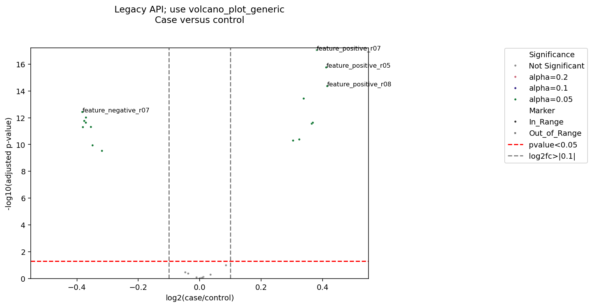
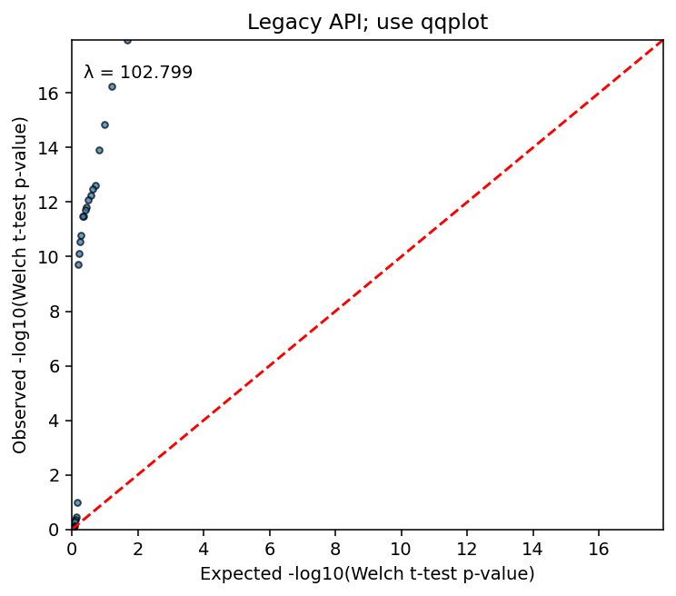
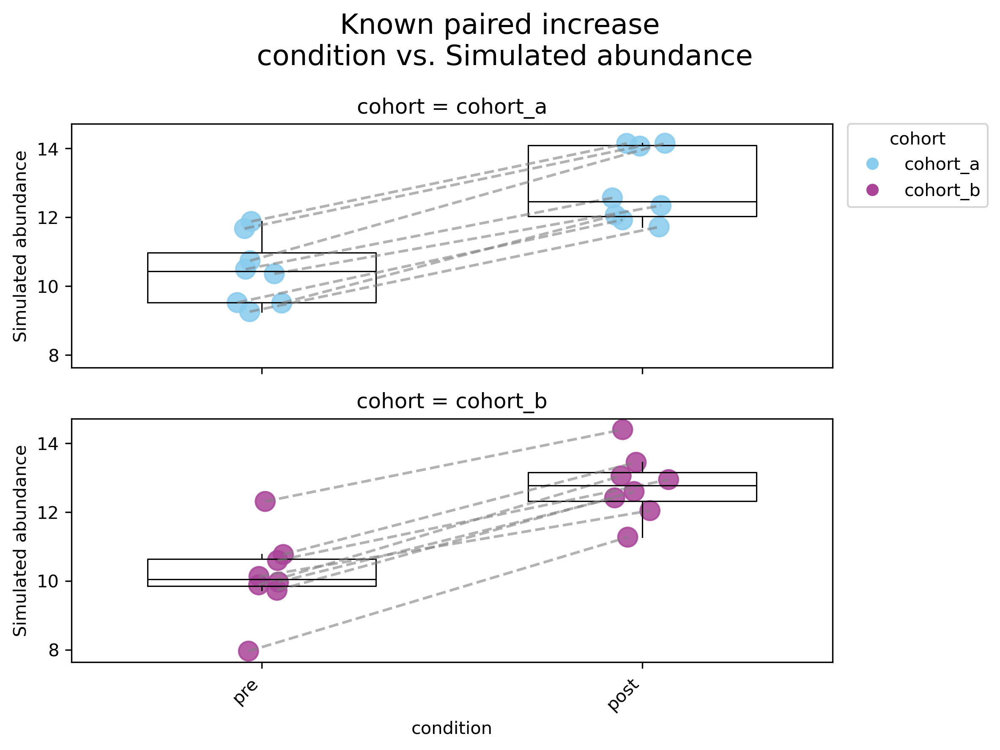
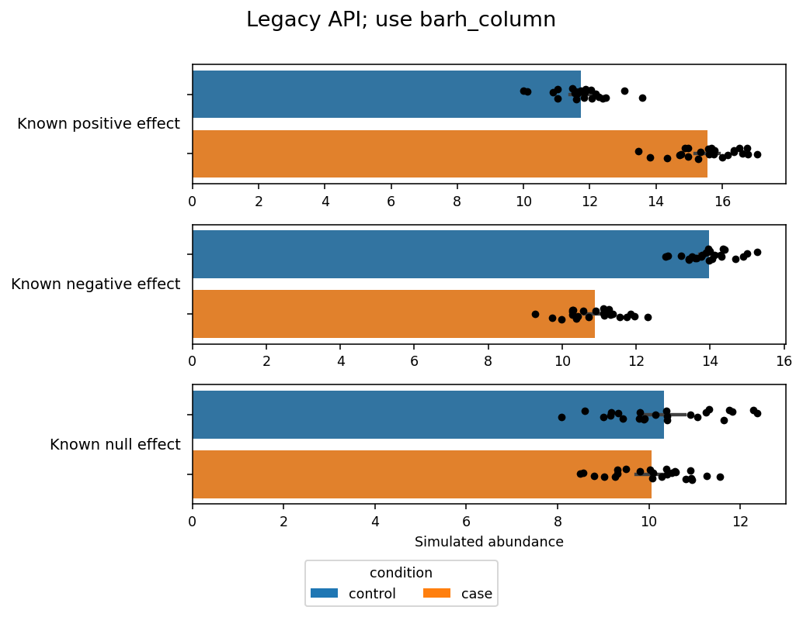
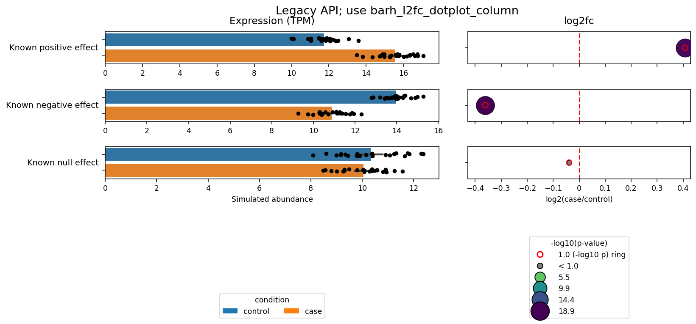
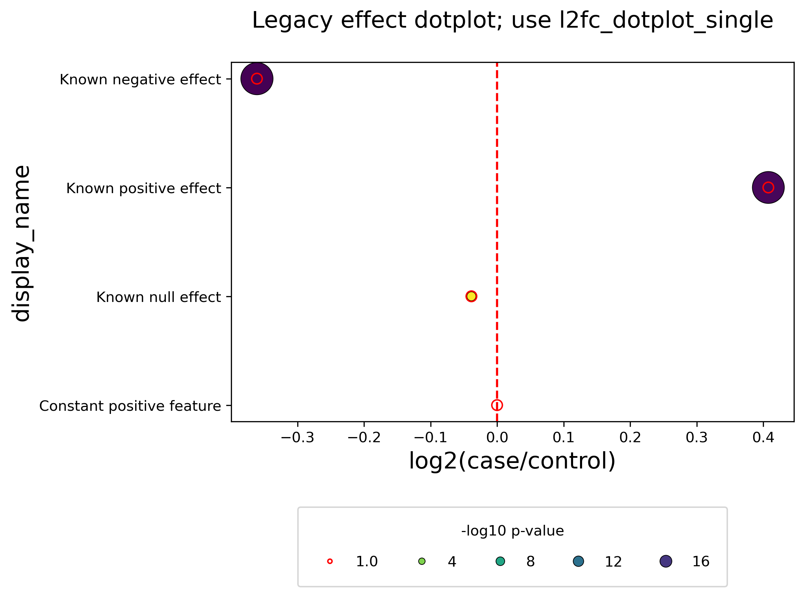
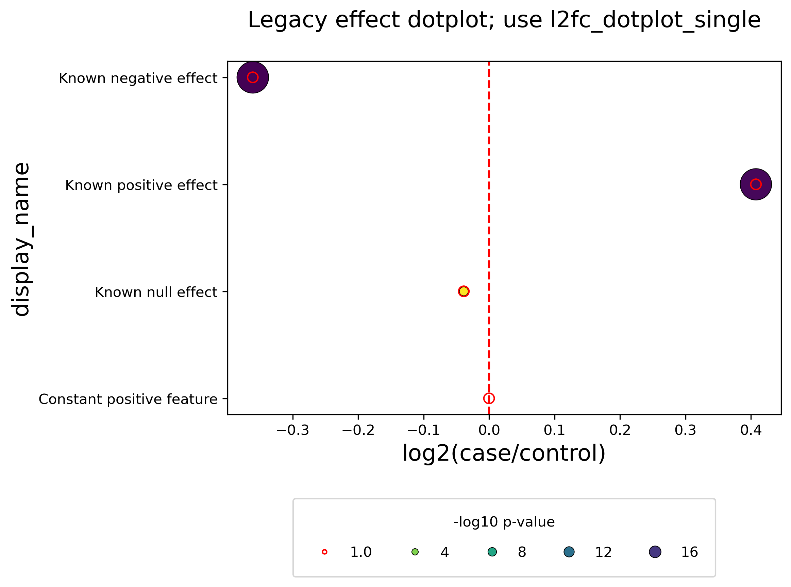

# `_plots_depreciated`

Legacy plotting functions from `_plotting/_plots_depreciated.py`.

The misspelled module name is part of the current public surface and is still re-exported by `_plotting/__init__.py`. These functions exist for backward compatibility, but the preferred APIs now live in newer plotting modules.

## Legacy entry points

- `volcano_plot_sns_single_comparison_generic`
- `qqplot_pvalues`
- `plot_paired_point_anndata`
- `plot_column_of_bar_h_2groups_GEX_adata`
- `plot_column_of_bar_h_2groups_with_l2fc_dotplot_GEX_adata`
- `l2fc_pvalue_dotplot_protein_metabolite`
- `l2fc_pvalue_dotplot_gex`

## Preferred replacements

- `volcano_plot_sns_single_comparison_generic` -> [`volcano_plot_generic`](./_plots.md)
- `qqplot_pvalues` -> [`qqplot`](./_plots.md)
- `plot_paired_point_anndata` -> [`timeseries_paired_datapoints`](./_plots.md)
- `plot_column_of_bar_h_2groups_GEX_adata` -> [`barh_column`](./_column_plots.md)
- `plot_column_of_bar_h_2groups_with_l2fc_dotplot_GEX_adata` -> [`barh_l2fc_dotplot_column`](./_column_plots.md)
- `l2fc_pvalue_dotplot_protein_metabolite` and `l2fc_pvalue_dotplot_gex` -> [`l2fc_dotplot_single`](./_column_plots.md) or the newer composite column builders

## Gallery example outputs

These images document deprecated compatibility paths only. Use the [preferred replacements](#preferred-replacements) listed above for new work.

### Deprecated: `volcano_plot_sns_single_comparison_generic`

*`replacement_smoke` — Legacy adjusted-p volcano plot. [Data and analysis provenance](plotting_gallery.md#data-and-analysis-provenance).*

Deprecated compatibility output; use the [preferred replacement listed above](#preferred-replacements).

### Deprecated: `qqplot_pvalues`

*`replacement_smoke` — Legacy p-value QQ plot. [Data and analysis provenance](plotting_gallery.md#data-and-analysis-provenance).*

Deprecated compatibility output; use the [preferred replacement listed above](#preferred-replacements).

### Deprecated: `plot_paired_point_anndata`

*`replacement_smoke` — Legacy paired time-series datapoints. [Data and analysis provenance](plotting_gallery.md#data-and-analysis-provenance).*

Deprecated compatibility output; use the [preferred replacement listed above](#preferred-replacements).

### Deprecated: `plot_column_of_bar_h_2groups_GEX_adata`

*`replacement_smoke` — Legacy grouped expression bars. [Data and analysis provenance](plotting_gallery.md#data-and-analysis-provenance).*

Deprecated compatibility output; use the [preferred replacement listed above](#preferred-replacements).

### Deprecated: `plot_column_of_bar_h_2groups_with_l2fc_dotplot_GEX_adata`

*`replacement_smoke` — Legacy expression and effect composite. [Data and analysis provenance](plotting_gallery.md#data-and-analysis-provenance).*

Deprecated compatibility output; use the [preferred replacement listed above](#preferred-replacements).

### Deprecated: `l2fc_pvalue_dotplot_protein_metabolite`

*`replacement_smoke` — Legacy protein/metabolite effect dotplot. [Data and analysis provenance](plotting_gallery.md#data-and-analysis-provenance).*

Deprecated compatibility output; use the [preferred replacement listed above](#preferred-replacements).

### Deprecated: `l2fc_pvalue_dotplot_gex`

*`replacement_smoke` — Legacy gene-expression effect dotplot. [Data and analysis provenance](plotting_gallery.md#data-and-analysis-provenance).*

Deprecated compatibility output; use the [preferred replacement listed above](#preferred-replacements).

## Important differences from the modern APIs

- The legacy volcano function uses `padj_col` rather than the current `pvalue_col`.
- The legacy QQ helper predates the newer dict-based `qqplot(...)` return contract.
- The older column-plot helpers are narrower and less configurable than the current `_column_plots.py` functions.

## Recommendation

Use this module only when maintaining older scripts that already depend on it. For new work, prefer `_plots.py` and `_column_plots.py`.

## Coverage note

The deprecated call paths are exercised by the manifest-driven gallery and
[`tests/test_plotting_gallery.py`](../tests/test_plotting_gallery.py), including
one deterministic smoke image per deprecated renderer. Those checks verify that
the compatibility paths still render; they are not full behavioral regression
suites for every legacy argument.
