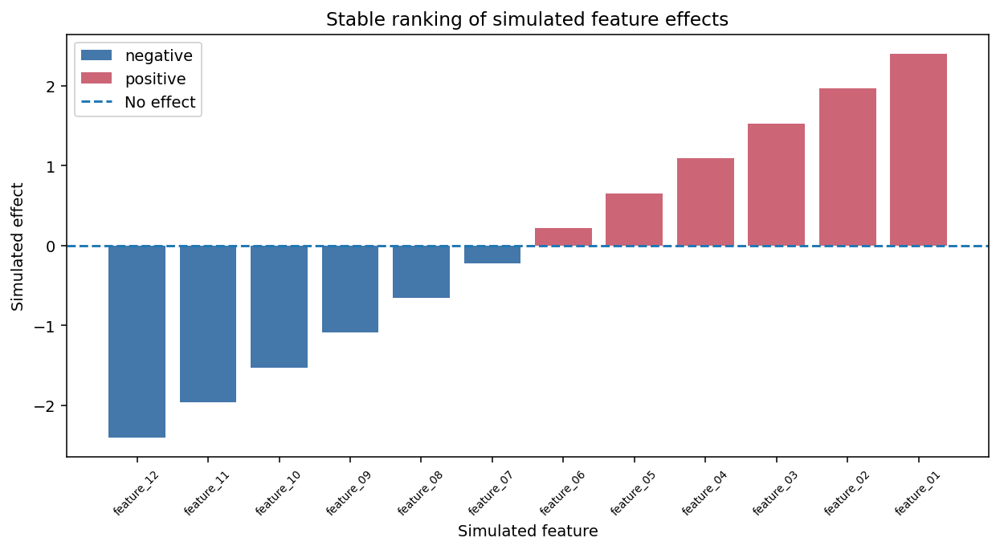
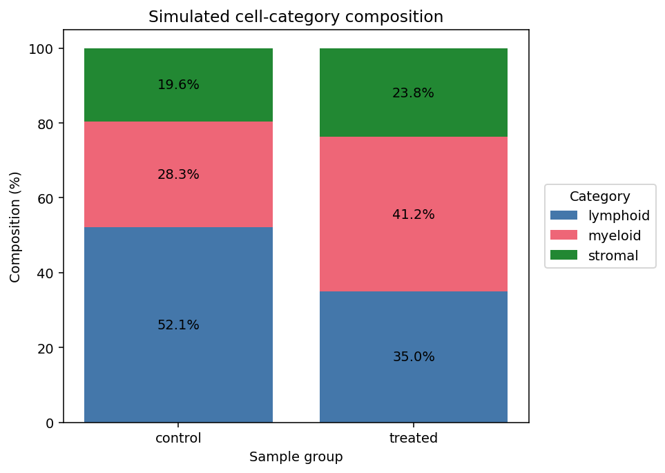
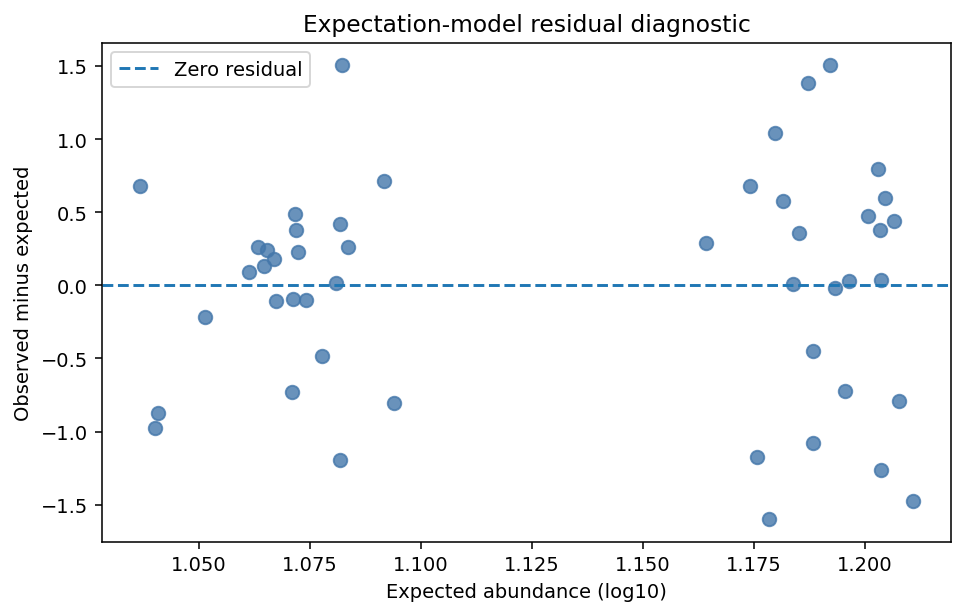
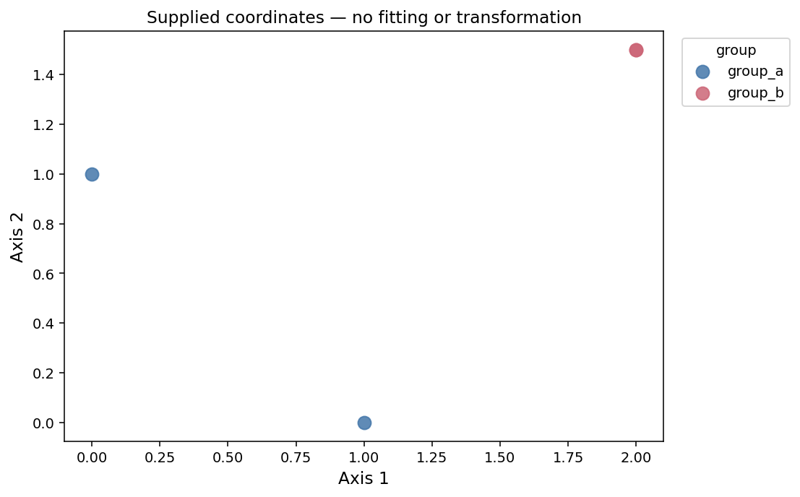

# Tabular plotting helpers

`_plotting/_tabular_plots.py` provides deterministic plots for tidy `pandas.DataFrame` input. Each function returns the exact prepared table used by its artists and leaves the caller's frame unchanged.

## `ranked_waterfall`

```python
def ranked_waterfall(
    df: pd.DataFrame,
    *,
    value: str,
    label: str,
    color_by: str | None = None,
    color_order: Sequence[Any] | None = None,
    palette: Mapping[Any, Any] | Sequence[Any] | str | None = None,
    ascending: bool = True,
    tie_breaker: str | None = None,
    allow_duplicate_labels: bool = False,
    y_reference_lines: Sequence[Mapping[str, Any]] | None = None,
    bar_width: float = 0.8,
    bar_alpha: float = 1.0,
    xlabel: str | None = None,
    ylabel: str | None = None,
    title: str | None = None,
    tick_rotation: float = 90,
    tick_fontsize: float | None = 7,
    legend_title: str | None = None,
    legend_kwargs: Mapping[str, Any] | None = None,
    figsize: tuple[float, float] = (10, 5),
    show: bool = True,
) -> tuple[plt.Figure, plt.Axes, pd.DataFrame]:
```

Rows are stably sorted by `value`, optional ascending `tie_breaker`, then input order. Missing or non-finite values and missing labels raise. Duplicate labels raise unless explicitly allowed. The returned copy adds zero-based `rank` and `resolved_color`; input columns may not already use either reserved name.

```python
fig, ax, ranked = adtl.ranked_waterfall(
    effects,
    value="estimate",
    label="feature",
    color_by="direction",
    palette={"down": "#4477AA", "up": "#CC6677"},
    y_reference_lines=[{"value": 0, "label": "No change", "linestyle": "--"}],
    show=False,
)
```



*`direction_colored` — Ranked feature effects. [Data and analysis provenance](plotting_gallery.md#data-and-analysis-provenance).*

## `category_composition`

```python
def category_composition(
    df: pd.DataFrame,
    *,
    x: str,
    category: str,
    x_order: Sequence[Any] | None = None,
    category_order: Sequence[Any] | None = None,
    palette: Mapping[Any, Any] | Sequence[Any] | str | None = None,
    normalize: Literal[False, "fraction", "percent"] = False,
    include_unobserved_x: bool = True,
    include_unobserved_categories: bool = True,
    missing_category: Literal["drop", "error", "label"] = "drop",
    missing_label: str = "Missing",
    annotate: bool = False,
    annotation_format: str | None = None,
    xlabel: str | None = None,
    ylabel: str | None = None,
    title: str | None = None,
    legend_title: str | None = None,
    legend_kwargs: Mapping[str, Any] | None = None,
    figsize: tuple[float, float] = (7, 5),
    show: bool = True,
) -> tuple[plt.Figure, plt.Axes, pd.DataFrame]:
```

Explicit order wins, categorical dtype order is next, and first-seen order is the fallback. The returned wide table contains counts, fractions, or percentages exactly as plotted. Labeling missing categories raises if `missing_label` collides with a real category.

```python
fig, ax, composition = adtl.category_composition(
    samples,
    x="cohort",
    category="response",
    normalize="percent",
    category_order=["Complete", "Partial", "None"],
    annotate=True,
    show=False,
)
```



*`percent_annotated` — Response composition by cohort. [Data and analysis provenance](plotting_gallery.md#data-and-analysis-provenance).*

## `residual_diagnostic`

```python
def residual_diagnostic(
    df: pd.DataFrame,
    *,
    x: str,
    residual: str,
    x_transform: Literal["none", "log", "log2", "log10"] = "none",
    y_reference_lines: Sequence[Mapping[str, Any]] | None = None,
    point_color: Any = "#4477AA",
    point_size: float = 48,
    point_alpha: float = 0.8,
    xlabel: str | None = None,
    ylabel: str | None = None,
    title: str | None = None,
    figsize: tuple[float, float] = (6, 4),
    dropna: bool = True,
    show: bool = True,
) -> tuple[plt.Figure, plt.Axes, pd.DataFrame]:
```

This function only plots caller-supplied residuals; it does not fit or infer a model. The returned frame contains `x_original`, `x_transformed`, and `residual`. Log transforms require positive rendered x values.

```python
fig, ax, plotted = adtl.residual_diagnostic(
    diagnostics,
    x="fitted",
    residual="residual",
    x_transform="log10",
    y_reference_lines=[{"value": 0, "label": "Zero residual"}],
    show=False,
)
```



*`log_fitted` — Residuals versus fitted abundance. [Data and analysis provenance](plotting_gallery.md#data-and-analysis-provenance).*

## Returned-data inspection and validation

The third return value is designed for audit and can be inspected or saved directly:

```python
ranked[["feature", "estimate", "rank", "resolved_color"]]
composition.loc[:, ["Complete", "Partial", "None"]]
plotted[["x_original", "x_transformed", "residual"]]
```

Validation is explicit rather than silently dropping ambiguous data. Waterfalls reject missing/non-finite values, missing labels, and duplicate labels unless duplicates are enabled. Compositions reject missing x values, unsupported missing-category policies, incomplete explicit orders, palette gaps, and missing-label collisions; when dropping missing categories leaves no observations, explicit or categorical orders can still return zero-total rows. Residual diagnostics reject invalid transform names, nonpositive log domains, non-finite rendered values, and missing values when `dropna=False`.

## `coordinate_scatter`

Render precomputed two-dimensional coordinates without regression, correlation,
embedding fitting, centering, or scaling. Existing `corr_dotplot` behavior is
unchanged. The new function is available as `adtl.coordinate_scatter`.

```python
def coordinate_scatter(
    df: pd.DataFrame,
    *,
    x: str,
    y: str,
    hue: str | None = None,
    hue_order: Sequence[Any] | None = None,
    palette: Mapping[Any, Any] | Sequence[Any] | str | None = None,
    point_size: float = 40,
    point_alpha: float = 0.85,
    xlabel: str | None = None,
    ylabel: str | None = None,
    xlims: Sequence[float] | None = None,
    ylims: Sequence[float] | None = None,
    title: str | None = None,
    axis_label_fontsize: float = 12,
    tick_fontsize: float = 10,
    legend: bool = True,
    legend_kwargs: Mapping[str, Any] | None = None,
    ax: plt.Axes | None = None,
    figsize: tuple[float, float] = (6, 5),
    show: bool = True,
    savefig: bool = False,
    file_name: str = "coordinate_scatter.png",
) -> tuple[plt.Figure, plt.Axes, pd.DataFrame]:
```

```python
import pandas as pd
import adata_science_tools as adtl

coordinates = pd.DataFrame({
    "axis_1": [0.0, 1.0, 2.0, 2.0],
    "axis_2": [1.0, 0.0, 1.5, 1.5],
    "group": ["group_a", "group_a", "group_b", "group_b"],
})
fig, ax, plotted = adtl.coordinate_scatter(
    coordinates, x="axis_1", y="axis_2", hue="group",
    hue_order=["group_a", "group_b"],
    palette={"group_a": "#4477AA", "group_b": "#CC6677"},
    xlabel="Axis 1", ylabel="Axis 2", point_size=85,
    legend_kwargs={"loc": "upper left", "bbox_to_anchor": (1.02, 1)},
    figsize=(8, 5), show=False,
)
```



The two coincident group B rows remain separate observations and overlap exactly.
Labels, including caller-provided explained-variance text, are used verbatim.
Coordinates must be numeric; numeric source values are not changed. Nonfinite or
missing coordinates omit the point. A missing hue also omits it. Empty inputs
produce empty axes; singleton groups and constant coordinates render normally.
Matplotlib expands constant axis limits for display without changing coordinates.

The third return value retains every source row, original column, index label,
and row order. `source_position` records the zero-based row position, including
when index labels repeat. `plot_status` is `plotted`, `nonfinite_coordinate`, or
`missing_hue`, with coordinate failure taking precedence. These identifiers are
never added to the visible plot. Conflicting input audit-column names raise an
error. The input frame is unchanged.

Explicit hue order takes precedence over categorical dtype order and first
appearance. It must include all observed categories; additional categories retain
empty legend entries. `plotted.attrs` records `hue_order` and `palette`.
`point_size` is marker area in points squared. `xlims`, `ylims`, `point_alpha`,
`axis_label_fontsize`, `tick_fontsize`, and `legend_kwargs` control appearance;
legend font size can be set through `legend_kwargs`. Use `legend=False` to hide it.

Use `savefig=True, file_name="coordinates.png"` to save with a tight bounding box.
A newly created figure is laid out and closed from GUI registration when
`show=False`, but remains usable through the return value. Supplied axes are
never shown, closed, or subjected to figure-wide layout. No global plotting
settings are changed.
