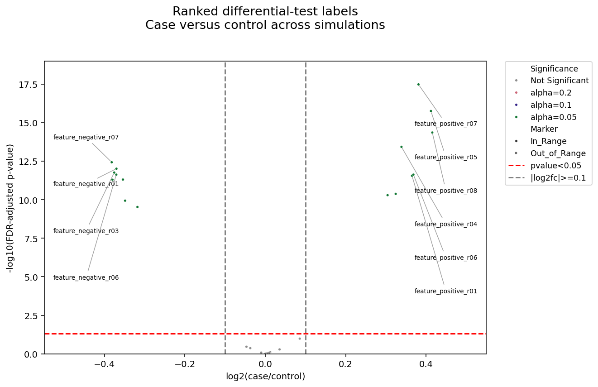

# Deterministic plotting gallery

This gallery is a repository-owned visual catalog for the plotting functions
exported by `adata_science_tools._plotting`. The coverage contract and asset
filenames come from
[`example_plotting_gallery/manifest.py`](../example_plotting_gallery/manifest.py):
45 renderers and 63 cases, split across maintained, compatibility, and
deprecated APIs.

The examples are for rendering and API coverage. They are not benchmark
datasets or evidence for biological conclusions.

## Data and analysis provenance

The inputs in
[`example_plotting_gallery/simulated_data.py`](../example_plotting_gallery/simulated_data.py)
are deterministic. Seeded builders create balanced independent groups, paired
subjects, repeated measurements, continuous observations, and composition
categories. Other builders return fixed survival curves and meta-analysis
rows. These precomputed tables, and the deterministic continuous-effect curve
and interval, are plotting inputs rather than estimates produced by the
library.

The `vbar_l2fc_dotplot_column` response-panel case and the vertical-interval
`datapoints_effect_panels_column` case read the fixed `synthetic_expression.csv` and
`synthetic_effects.csv` fixtures. Every sample, feature, group assignment,
abundance, effect, and interval is synthetic. The effect intervals are supplied
plotting values and are not estimated from the expression table. Response group,
subtype, and cohort remain constant for each synthetic sample across feature
rows. The latter case reshapes the long expression fixture into the preferred
API's aligned wide expression, observation-metadata, and feature-metadata
tables without changing any values.

Some examples deliberately consume analysis results produced by public library
functions:

| Library-derived result | Gallery consumers |
| --- | --- |
| `diff_test` effects and p-values, via `run_independent_diff_test` | The exploratory and one- through four-effect `datapoints_effect_panels_column` cases, `barh_l2fc_dotplot_column`, `barh_dotplot_dotplot_column`, `barh_dotplot_dotplot_dotplot_column`, `barh_4X_dotplot_column`, `l2fc_dotplot_column`, `l2fc_dotplot_single`, `qqplot`, and `volcano_plot_generic`; the deprecated `l2fc_pvalue_dotplot_gex`, `l2fc_pvalue_dotplot_protein_metabolite`, `plot_column_of_bar_h_2groups_with_l2fc_dotplot_GEX_adata`, `qqplot_pvalues`, and `volcano_plot_sns_single_comparison_generic` cases reuse the same results through their legacy contracts. |
| `fit_smf_ols_models_and_summarize_adata` coefficients, confidence intervals, p-values, and sample counts | Both `forest` cases, plus the adjusted OLS panels in the three- and four-effect `datapoints_effect_panels_column` cases, `barh_dotplot_dotplot_dotplot_column`, and `barh_4X_dotplot_column`. |
| `calculate_expectations`, `predict_expectation`, and `excess_expectation` fitted values and residuals | `residual_diagnostic`. |
| `pairwise_spearman_corr_matrix` rank-correlation matrix | Both `plot_heatmap` cases. The three `plot_rank_*` renderers instead calculate their displayed rank summaries from the deterministic ranked lists passed to them. |
| `scipy.stats.hypergeom` upper-tail probability from fixed synthetic universe, hit, and gene-set identifiers | `geneset_enrichment_venn` and the deprecated `geneset_enrichemnt_ol_ven_M_n_N_x`. The maintained API also demonstrates filtering out-of-universe identifiers; every legacy-case identifier is already contained in its supplied universe. |

`run_independent_diff_test` never assigns a sorted or filtered result table
directly to `AnnData.var`. It starts from a copy of the original `AnnData` and
left-joins only result columns on the original variable index. This preserves
the matrix-variable alignment and original variable order; a feature omitted
by `diff_test`, such as the all-zero fixture, remains in `var` with missing
analysis values.

## Coverage boundaries

The manifest labels 30 renderers as maintained, 6 as compatibility APIs, and 9
as deprecated. Compatibility and deprecated entries remain in the catalog so
their current call paths and recommended replacements are visible; their
screenshots do not change their support status.

## Regenerate the assets

The `plotting_gallery_params` block in
[`config/config.yaml`](../config/config.yaml) controls the asset directory, log
directory, selected renderer names, selected case IDs, and whether generation
continues after an error. Null renderer and case selections generate all
manifest cases. From the repository root, run:

```bash
bash scripts/000_generate_plotting_gallery.bash
```

The runner sources `config/local_env.sh`, activates `POSTPROCESS_ENV`, configures
headless Matplotlib, writes a runner log under `scripts/logs`, and leaves
analysis and output selection to the Python entry point and YAML config.

## Catalog

The entries, order, case IDs, titles, statuses, replacements, and filenames
below are derived from `RENDERER_MANIFEST`; the manifest remains authoritative
if coverage changes.

Each renderer card has a stable permalink. Select the renderer name to open
its API page, or select an image to view the full-size PNG. Preview widths are
scaled by aspect ratio so panoramic multi-panel figures remain legible without
oversizing square or portrait plots.

### Maintained renderers (30)

<details>
<summary>Jump to a maintained renderer</summary>
<ul>
<li><a href="#renderer-adata_histograms"><code>adata_histograms</code></a></li>
<li><a href="#renderer-barh_column"><code>barh_column</code></a></li>
<li><a href="#renderer-datapoints_effect_panels_column"><code>datapoints_effect_panels_column</code></a></li>
<li><a href="#renderer-category_composition"><code>category_composition</code></a></li>
<li><a href="#renderer-continuous_effect_plot"><code>continuous_effect_plot</code></a></li>
<li><a href="#renderer-corr_dotplot"><code>corr_dotplot</code></a></li>
<li><a href="#renderer-datapoints"><code>datapoints</code></a></li>
<li><a href="#renderer-forest"><code>forest</code></a></li>
<li><a href="#renderer-geneset_enrichment_venn"><code>geneset_enrichment_venn</code></a></li>
<li><a href="#renderer-kaplan_meier_plot"><code>kaplan_meier_plot</code></a></li>
<li><a href="#renderer-l2fc_dotplot_column"><code>l2fc_dotplot_column</code></a></li>
<li><a href="#renderer-l2fc_dotplot_single"><code>l2fc_dotplot_single</code></a></li>
<li><a href="#renderer-longitudinal_trajectories"><code>longitudinal_trajectories</code></a></li>
<li><a href="#renderer-meta_forest"><code>meta_forest</code></a></li>
<li><a href="#renderer-paired_datapoints"><code>paired_datapoints</code></a></li>
<li><a href="#renderer-plot_columns"><code>plot_columns</code></a></li>
<li><a href="#renderer-plot_heatmap"><code>plot_heatmap</code></a></li>
<li><a href="#renderer-plot_rank_heatmap"><code>plot_rank_heatmap</code></a></li>
<li><a href="#renderer-plot_rank_scatter"><code>plot_rank_scatter</code></a></li>
<li><a href="#renderer-plot_rank_scatter_density"><code>plot_rank_scatter_density</code></a></li>
<li><a href="#renderer-qqplot"><code>qqplot</code></a></li>
<li><a href="#renderer-ranked_waterfall"><code>ranked_waterfall</code></a></li>
<li><a href="#renderer-residual_diagnostic"><code>residual_diagnostic</code></a></li>
<li><a href="#renderer-show_colors"><code>show_colors</code></a></li>
<li><a href="#renderer-show_tol_colors"><code>show_tol_colors</code></a></li>
<li><a href="#renderer-spearman_cor_dotplot_2"><code>spearman_cor_dotplot_2</code></a></li>
<li><a href="#renderer-timeseries_paired_datapoints"><code>timeseries_paired_datapoints</code></a></li>
<li><a href="#renderer-venn_plot_2list"><code>venn_plot_2list</code></a></li>
<li><a href="#renderer-venn_plot_3list"><code>venn_plot_3list</code></a></li>
<li><a href="#renderer-volcano_plot_generic"><code>volcano_plot_generic</code></a></li>
</ul>
</details>

<a id="renderer-adata_histograms"></a>

<table>
<tr><td>
<strong><a href="_histograms.md"><code>adata_histograms</code></a></strong><br>
<small><code>_plotting._histograms</code> · Maintained · <a href="#renderer-adata_histograms">Permalink</a></small>
</td></tr>
<tr><td>
<a href="assets/plotting_gallery/adata_histograms__subgroup_kde.png"></a><br>
<code>subgroup_kde</code> — Distributions by treatment
<br><br>
<a href="assets/plotting_gallery/adata_histograms__feature_group_collapse.png"></a><br>
<code>feature_group_collapse</code> — Grouped feature distributions
</td></tr>
</table>

<a id="renderer-barh_column"></a>

<table>
<tr><td>
<strong><a href="_column_plots.md"><code>barh_column</code></a></strong><br>
<small><code>_plotting._column_plots</code> · Maintained · <a href="#renderer-barh_column">Permalink</a></small>
</td></tr>
<tr><td>
<a href="assets/plotting_gallery/barh_column__grouped_expression.png"></a><br>
<code>grouped_expression</code> — Feature abundance by treatment
</td></tr>
</table>

<a id="renderer-datapoints_effect_panels_column"></a>

<table>
<tr><td>
<strong><a href="_column_plots.md"><code>datapoints_effect_panels_column</code></a></strong><br>
<small><code>_plotting._column_plots</code> · Maintained · <a href="#renderer-datapoints_effect_panels_column">Permalink</a></small>
</td></tr>
<tr><td>
<a href="assets/plotting_gallery/datapoints_effect_panels_column__horizontal_pvalue.png"></a><br>
<code>horizontal_pvalue</code> — Horizontal distributions with p-value effects
<br><br>
<a href="assets/plotting_gallery/datapoints_effect_panels_column__horizontal_one_effect.png"></a><br>
<code>horizontal_one_effect</code> — Horizontal distributions with one effect summary
<br><br>
<a href="assets/plotting_gallery/datapoints_effect_panels_column__horizontal_two_effects.png"></a><br>
<code>horizontal_two_effects</code> — Horizontal distributions with two effect summaries
<br><br>
<a href="assets/plotting_gallery/datapoints_effect_panels_column__horizontal_three_effects.png"></a><br>
<code>horizontal_three_effects</code> — Horizontal distributions with three effect summaries
<br><br>
<a href="assets/plotting_gallery/datapoints_effect_panels_column__horizontal_four_effects.png"></a><br>
<code>horizontal_four_effects</code> — Horizontal distributions with four effect summaries
<br><br>
<a href="assets/plotting_gallery/datapoints_effect_panels_column__vertical_interval.png"></a><br>
<code>vertical_interval</code> — Vertical distributions with supplied intervals
</td></tr>
</table>

<a id="renderer-category_composition"></a>

<table>
<tr><td>
<strong><a href="_tabular_plots.md"><code>category_composition</code></a></strong><br>
<small><code>_plotting._tabular_plots</code> · Maintained · <a href="#renderer-category_composition">Permalink</a></small>
</td></tr>
<tr><td>
<a href="assets/plotting_gallery/category_composition__percent_annotated.png"></a><br>
<code>percent_annotated</code> — Response composition by cohort
</td></tr>
</table>

<a id="renderer-continuous_effect_plot"></a>

<table>
<tr><td>
<strong><a href="_analytical_plots.md"><code>continuous_effect_plot</code></a></strong><br>
<small><code>_plotting._analytical_plots</code> · Maintained · <a href="#renderer-continuous_effect_plot">Permalink</a></small>
</td></tr>
<tr><td>
<a href="assets/plotting_gallery/continuous_effect_plot__observed_categories.png"></a><br>
<code>observed_categories</code> — Continuous exposure effect
</td></tr>
</table>

<a id="renderer-corr_dotplot"></a>

<table>
<tr><td>
<strong><a href="_corr_dotplots.md"><code>corr_dotplot</code></a></strong><br>
<small><code>_plotting._corr_dotplots</code> · Maintained · <a href="#renderer-corr_dotplot">Permalink</a></small>
</td></tr>
<tr><td>
<a href="assets/plotting_gallery/corr_dotplot__subgroup_marginals.png"></a><br>
<code>subgroup_marginals</code> — Correlation with subgroup fits and marginals
<br><br>
<a href="assets/plotting_gallery/corr_dotplot__log1p_identity.png"></a><br>
<code>log1p_identity</code> — Correlation on synchronized log1p axes
</td></tr>
</table>

<a id="renderer-datapoints"></a>

<table>
<tr><td>
<strong><a href="_datapoints.md"><code>datapoints</code></a></strong><br>
<small><code>_plotting._datapoints</code> · Maintained · <a href="#renderer-datapoints">Permalink</a></small>
</td></tr>
<tr><td>
<a href="assets/plotting_gallery/datapoints__grouped_markers.png"></a><br>
<code>grouped_markers</code> — Feature values with independent marker and color encodings
<br><br>
<a href="assets/plotting_gallery/datapoints__feature_group_collapse.png"></a><br>
<code>feature_group_collapse</code> — Collapsed feature-group datapoints
</td></tr>
</table>

<a id="renderer-forest"></a>

<table>
<tr><td>
<strong><a href="_forest.md"><code>forest</code></a></strong><br>
<small><code>_plotting._forest</code> · Maintained · <a href="#renderer-forest">Permalink</a></small>
</td></tr>
<tr><td>
<a href="assets/plotting_gallery/forest__grouped_estimates.png"></a><br>
<code>grouped_estimates</code> — Grouped model estimates
<br><br>
<a href="assets/plotting_gallery/forest__ratio_scale.png"></a><br>
<code>ratio_scale</code> — Ratio-scale effects
</td></tr>
</table>

<a id="renderer-geneset_enrichment_venn"></a>

<table>
<tr><td>
<strong><a href="_venn_plots.md"><code>geneset_enrichment_venn</code></a></strong><br>
<small><code>_plotting._venn_plots</code> · Maintained · <a href="#renderer-geneset_enrichment_venn">Permalink</a></small>
</td></tr>
<tr><td>
<a href="assets/plotting_gallery/geneset_enrichment_venn__universe_filtered.png"></a><br>
<code>universe_filtered</code> — Gene-set enrichment overlap
</td></tr>
</table>

<a id="renderer-kaplan_meier_plot"></a>

<table>
<tr><td>
<strong><a href="_analytical_plots.md"><code>kaplan_meier_plot</code></a></strong><br>
<small><code>_plotting._analytical_plots</code> · Maintained · <a href="#renderer-kaplan_meier_plot">Permalink</a></small>
</td></tr>
<tr><td>
<a href="assets/plotting_gallery/kaplan_meier_plot__grouped_risk_censor.png"></a><br>
<code>grouped_risk_censor</code> — Survival curves with numbers at risk
</td></tr>
</table>

<a id="renderer-l2fc_dotplot_column"></a>

<table>
<tr><td>
<strong><a href="_column_plots.md"><code>l2fc_dotplot_column</code></a></strong><br>
<small><code>_plotting._column_plots</code> · Maintained · <a href="#renderer-l2fc_dotplot_column">Permalink</a></small>
</td></tr>
<tr><td>
<a href="assets/plotting_gallery/l2fc_dotplot_column__multi_feature.png"></a><br>
<code>multi_feature</code> — Differential effects by feature
</td></tr>
</table>

<a id="renderer-l2fc_dotplot_single"></a>

<table>
<tr><td>
<strong><a href="_column_plots.md"><code>l2fc_dotplot_single</code></a></strong><br>
<small><code>_plotting._column_plots</code> · Maintained · <a href="#renderer-l2fc_dotplot_single">Permalink</a></small>
</td></tr>
<tr><td>
<a href="assets/plotting_gallery/l2fc_dotplot_single__single_axis.png"></a><br>
<code>single_axis</code> — Differential effect overview
</td></tr>
</table>

<a id="renderer-longitudinal_trajectories"></a>

<table>
<tr><td>
<strong><a href="_longitudinal.md"><code>longitudinal_trajectories</code></a></strong><br>
<small><code>_plotting._longitudinal</code> · Maintained · <a href="#renderer-longitudinal_trajectories">Permalink</a></small>
</td></tr>
<tr><td>
<a href="assets/plotting_gallery/longitudinal_trajectories__markers_and_gaps.png"></a><br>
<code>markers_and_gaps</code> — Longitudinal trajectories with visit gaps
</td></tr>
</table>

<a id="renderer-meta_forest"></a>

<table>
<tr><td>
<strong><a href="_meta_forest.md"><code>meta_forest</code></a></strong><br>
<small><code>_plotting._meta_forest</code> · Maintained · <a href="#renderer-meta_forest">Permalink</a></small>
</td></tr>
<tr><td>
<a href="assets/plotting_gallery/meta_forest__study_summary_prediction.png"></a><br>
<code>study_summary_prediction</code> — Meta-analysis summary
</td></tr>
</table>

<a id="renderer-paired_datapoints"></a>

<table>
<tr><td>
<strong><a href="_paired_datapoints.md"><code>paired_datapoints</code></a></strong><br>
<small><code>_plotting._datapoints</code> · Maintained · <a href="#renderer-paired_datapoints">Permalink</a></small>
</td></tr>
<tr><td>
<a href="assets/plotting_gallery/paired_datapoints__paired_groups.png"></a><br>
<code>paired_groups</code> — Paired changes by treatment
<br><br>
<a href="assets/plotting_gallery/paired_datapoints__slope_colored_lines.png"></a><br>
<code>slope_colored_lines</code> — Paired lines colored by relative change
<br><br>
<a href="assets/plotting_gallery/paired_datapoints__difference_axis.png"></a><br>
<code>difference_axis</code> — Varied paired slopes and signed differences
<br><br>
<a href="assets/plotting_gallery/paired_datapoints__log2fc_axis.png"></a><br>
<code>log2fc_axis</code> — Varied paired slopes and log2 fold changes
<br><br>
<a href="assets/plotting_gallery/paired_datapoints__difference_summary_legend.png"></a><br>
<code>difference_summary_legend</code> — Baseline, post, and raw-difference summaries
<br><br>
<a href="assets/plotting_gallery/paired_datapoints__log2fc_summary_legend.png"></a><br>
<code>log2fc_summary_legend</code> — Baseline, post, and log2FC summaries
<br><br>
<a href="assets/plotting_gallery/paired_datapoints__precomputed_pair_values.png"></a><br>
<code>precomputed_pair_values</code> — Paired values from preserved source matrices
</td></tr>
</table>

<a id="renderer-plot_columns"></a>

<table>
<tr><td>
<strong><a href="_row_plots.md"><code>plot_columns</code></a></strong><br>
<small><code>_plotting._row_plots</code> · Maintained · <a href="#renderer-plot_columns">Permalink</a></small>
</td></tr>
<tr><td>
<a href="assets/plotting_gallery/plot_columns__multi_metric.png"></a><br>
<code>multi_metric</code> — Grouped covariate summaries
</td></tr>
</table>

<a id="renderer-plot_heatmap"></a>

<table>
<tr><td>
<strong><a href="_corr_dotplots.md"><code>plot_heatmap</code></a></strong><br>
<small><code>_plotting._corr_dotplots</code> · Maintained · <a href="#renderer-plot_heatmap">Permalink</a></small>
</td></tr>
<tr><td>
<a href="assets/plotting_gallery/plot_heatmap__clustered.png"></a><br>
<code>clustered</code> — Clustered rank-correlation heatmap
<br><br>
<a href="assets/plotting_gallery/plot_heatmap__fixed_order.png"></a><br>
<code>fixed_order</code> — Fixed-order rank-correlation heatmap
</td></tr>
</table>

<a id="renderer-plot_rank_heatmap"></a>

<table>
<tr><td>
<strong><a href="_corr_dotplots.md"><code>plot_rank_heatmap</code></a></strong><br>
<small><code>_plotting._corr_dotplots</code> · Maintained · <a href="#renderer-plot_rank_heatmap">Permalink</a></small>
</td></tr>
<tr><td>
<a href="assets/plotting_gallery/plot_rank_heatmap__rank_hexbin.png"></a><br>
<code>rank_hexbin</code> — Rank agreement density
</td></tr>
</table>

<a id="renderer-plot_rank_scatter"></a>

<table>
<tr><td>
<strong><a href="_corr_dotplots.md"><code>plot_rank_scatter</code></a></strong><br>
<small><code>_plotting._corr_dotplots</code> · Maintained · <a href="#renderer-plot_rank_scatter">Permalink</a></small>
</td></tr>
<tr><td>
<a href="assets/plotting_gallery/plot_rank_scatter__rank_agreement.png"></a><br>
<code>rank_agreement</code> — Rank agreement
</td></tr>
</table>

<a id="renderer-plot_rank_scatter_density"></a>

<table>
<tr><td>
<strong><a href="_corr_dotplots.md"><code>plot_rank_scatter_density</code></a></strong><br>
<small><code>_plotting._corr_dotplots</code> · Maintained · <a href="#renderer-plot_rank_scatter_density">Permalink</a></small>
</td></tr>
<tr><td>
<a href="assets/plotting_gallery/plot_rank_scatter_density__rank_density.png"></a><br>
<code>rank_density</code> — Rank agreement with local density
</td></tr>
</table>

<a id="renderer-qqplot"></a>

<table>
<tr><td>
<strong><a href="_plots.md"><code>qqplot</code></a></strong><br>
<small><code>_plotting._plots</code> · Maintained · <a href="#renderer-qqplot">Permalink</a></small>
</td></tr>
<tr><td>
<a href="assets/plotting_gallery/qqplot__differential_pvalues.png"></a><br>
<code>differential_pvalues</code> — Differential-test p-value QQ plot
</td></tr>
</table>

<a id="renderer-ranked_waterfall"></a>

<table>
<tr><td>
<strong><a href="_tabular_plots.md"><code>ranked_waterfall</code></a></strong><br>
<small><code>_plotting._tabular_plots</code> · Maintained · <a href="#renderer-ranked_waterfall">Permalink</a></small>
</td></tr>
<tr><td>
<a href="assets/plotting_gallery/ranked_waterfall__direction_colored.png"></a><br>
<code>direction_colored</code> — Ranked feature effects
</td></tr>
</table>

<a id="renderer-residual_diagnostic"></a>

<table>
<tr><td>
<strong><a href="_tabular_plots.md"><code>residual_diagnostic</code></a></strong><br>
<small><code>_plotting._tabular_plots</code> · Maintained · <a href="#renderer-residual_diagnostic">Permalink</a></small>
</td></tr>
<tr><td>
<a href="assets/plotting_gallery/residual_diagnostic__log_fitted.png"></a><br>
<code>log_fitted</code> — Residuals versus fitted abundance
</td></tr>
</table>

<a id="renderer-show_colors"></a>

<table>
<tr><td>
<strong><a href="_utils.md"><code>show_colors</code></a></strong><br>
<small><code>_plotting._utils</code> · Maintained · <a href="#renderer-show_colors">Permalink</a></small>
</td></tr>
<tr><td>
<a href="assets/plotting_gallery/show_colors__categorical_palette.png"></a><br>
<code>categorical_palette</code> — Categorical plotting palette
</td></tr>
</table>

<a id="renderer-show_tol_colors"></a>

<table>
<tr><td>
<strong><a href="_utils.md"><code>show_tol_colors</code></a></strong><br>
<small><code>_plotting._utils</code> · Maintained · <a href="#renderer-show_tol_colors">Permalink</a></small>
</td></tr>
<tr><td>
<a href="assets/plotting_gallery/show_tol_colors__tol_palette.png"></a><br>
<code>tol_palette</code> — Paul Tol plotting palette
</td></tr>
</table>

<a id="renderer-spearman_cor_dotplot_2"></a>

<table>
<tr><td>
<strong><a href="_corr_dotplots.md"><code>spearman_cor_dotplot_2</code></a></strong><br>
<small><code>_plotting._corr_dotplots</code> · Maintained · <a href="#renderer-spearman_cor_dotplot_2">Permalink</a></small>
</td></tr>
<tr><td>
<a href="assets/plotting_gallery/spearman_cor_dotplot_2__dual_hue.png"></a><br>
<code>dual_hue</code> — Correlation under two categorical encodings
</td></tr>
</table>

<a id="renderer-timeseries_paired_datapoints"></a>

<table>
<tr><td>
<strong><a href="_plots.md"><code>timeseries_paired_datapoints</code></a></strong><br>
<small><code>_plotting._plots</code> · Maintained · <a href="#renderer-timeseries_paired_datapoints">Permalink</a></small>
</td></tr>
<tr><td>
<a href="assets/plotting_gallery/timeseries_paired_datapoints__faceted_time_series.png"></a><br>
<code>faceted_time_series</code> — Paired time-series datapoints
</td></tr>
</table>

<a id="renderer-venn_plot_2list"></a>

<table>
<tr><td>
<strong><a href="_venn_plots.md"><code>venn_plot_2list</code></a></strong><br>
<small><code>_plotting._venn_plots</code> · Maintained · <a href="#renderer-venn_plot_2list">Permalink</a></small>
</td></tr>
<tr><td>
<a href="assets/plotting_gallery/venn_plot_2list__two_set_overlap.png"></a><br>
<code>two_set_overlap</code> — Two feature-set overlap
</td></tr>
</table>

<a id="renderer-venn_plot_3list"></a>

<table>
<tr><td>
<strong><a href="_venn_plots.md"><code>venn_plot_3list</code></a></strong><br>
<small><code>_plotting._venn_plots</code> · Maintained · <a href="#renderer-venn_plot_3list">Permalink</a></small>
</td></tr>
<tr><td>
<a href="assets/plotting_gallery/venn_plot_3list__three_set_overlap.png"></a><br>
<code>three_set_overlap</code> — Three feature-set overlap
</td></tr>
</table>

<a id="renderer-volcano_plot_generic"></a>

<table>
<tr><td>
<strong><a href="_plots.md"><code>volcano_plot_generic</code></a></strong><br>
<small><code>_plotting._plots</code> · Maintained · <a href="#renderer-volcano_plot_generic">Permalink</a></small>
</td></tr>
<tr><td>
<a href="assets/plotting_gallery/volcano_plot_generic__significance.png"></a><br>
<code>significance</code> — Differential-test volcano plot
<br><br>
<a href="assets/plotting_gallery/volcano_plot_generic__ranked_columns.png"></a><br>
<code>ranked_columns</code> — Ranked volcano labels in side columns
<br><br>
<a href="assets/plotting_gallery/volcano_plot_generic__feature_class.png"></a><br>
<code>feature_class</code> — Volcano plot with feature-class highlighting
</td></tr>
</table>

### Compatibility renderers (6)

<details>
<summary>Jump to a compatibility renderer</summary>
<ul>
<li><a href="#renderer-barh_4X_dotplot_column"><code>barh_4X_dotplot_column</code></a></li>
<li><a href="#renderer-barh_dotplot_dotplot_column"><code>barh_dotplot_dotplot_column</code></a></li>
<li><a href="#renderer-barh_dotplot_dotplot_dotplot_column"><code>barh_dotplot_dotplot_dotplot_column</code></a></li>
<li><a href="#renderer-barh_l2fc_dotplot_column"><code>barh_l2fc_dotplot_column</code></a></li>
<li><a href="#renderer-vbar_l2fc_dotplot_column"><code>vbar_l2fc_dotplot_column</code></a></li>
<li><a href="#renderer-spearman_cor_dotplot"><code>spearman_cor_dotplot</code></a></li>
</ul>
</details>

<a id="renderer-barh_4X_dotplot_column"></a>

<table>
<tr><td>
<strong><a href="_column_plots.md"><code>barh_4X_dotplot_column</code></a></strong><br>
<small><code>_plotting._column_plots</code> · Compatibility · <a href="#renderer-barh_4X_dotplot_column">Permalink</a> · Replacement: <a href="#renderer-datapoints_effect_panels_column"><code>datapoints_effect_panels_column</code></a></small>
</td></tr>
<tr><td>
<a href="assets/plotting_gallery/barh_4X_dotplot_column__five_panel.png"></a><br>
<code>five_panel</code> — Expression with four inferential summaries
</td></tr>
</table>

<a id="renderer-barh_dotplot_dotplot_column"></a>

<table>
<tr><td>
<strong><a href="_column_plots.md"><code>barh_dotplot_dotplot_column</code></a></strong><br>
<small><code>_plotting._column_plots</code> · Compatibility · <a href="#renderer-barh_dotplot_dotplot_column">Permalink</a> · Replacement: <a href="#renderer-datapoints_effect_panels_column"><code>datapoints_effect_panels_column</code></a></small>
</td></tr>
<tr><td>
<a href="assets/plotting_gallery/barh_dotplot_dotplot_column__three_panel.png"></a><br>
<code>three_panel</code> — Expression with two differential summaries
</td></tr>
</table>

<a id="renderer-barh_dotplot_dotplot_dotplot_column"></a>

<table>
<tr><td>
<strong><a href="_column_plots.md"><code>barh_dotplot_dotplot_dotplot_column</code></a></strong><br>
<small><code>_plotting._column_plots</code> · Compatibility · <a href="#renderer-barh_dotplot_dotplot_dotplot_column">Permalink</a> · Replacement: <a href="#renderer-datapoints_effect_panels_column"><code>datapoints_effect_panels_column</code></a></small>
</td></tr>
<tr><td>
<a href="assets/plotting_gallery/barh_dotplot_dotplot_dotplot_column__four_panel.png"></a><br>
<code>four_panel</code> — Expression with three differential summaries
</td></tr>
</table>

<a id="renderer-barh_l2fc_dotplot_column"></a>

<table>
<tr><td>
<strong><a href="_column_plots.md"><code>barh_l2fc_dotplot_column</code></a></strong><br>
<small><code>_plotting._column_plots</code> · Compatibility · <a href="#renderer-barh_l2fc_dotplot_column">Permalink</a> · Replacement: <a href="#renderer-datapoints_effect_panels_column"><code>datapoints_effect_panels_column</code></a></small>
</td></tr>
<tr><td>
<a href="assets/plotting_gallery/barh_l2fc_dotplot_column__two_panel.png"></a><br>
<code>two_panel</code> — Expression and differential effect
</td></tr>
</table>

<a id="renderer-vbar_l2fc_dotplot_column"></a>

<table>
<tr><td>
<strong><a href="_column_plots.md"><code>vbar_l2fc_dotplot_column</code></a></strong><br>
<small><code>_plotting._column_plots</code> · Compatibility · <a href="#renderer-vbar_l2fc_dotplot_column">Permalink</a> · Replacement: <a href="#renderer-datapoints_effect_panels_column"><code>datapoints_effect_panels_column</code></a></small>
</td></tr>
<tr><td>
<a href="assets/plotting_gallery/vbar_l2fc_dotplot_column__synthetic_response_panel.png"></a><br>
<code>synthetic_response_panel</code> — Synthetic response-associated expression panel
</td></tr>
</table>

<a id="renderer-spearman_cor_dotplot"></a>

<table>
<tr><td>
<strong><a href="_corr_dotplots.md"><code>spearman_cor_dotplot</code></a></strong><br>
<small><code>_plotting._corr_dotplots</code> · Compatibility · <a href="#renderer-spearman_cor_dotplot">Permalink</a> · Replacement: <a href="#renderer-corr_dotplot"><code>corr_dotplot</code></a></small>
</td></tr>
<tr><td>
<a href="assets/plotting_gallery/spearman_cor_dotplot__spearman_fit.png"></a><br>
<code>spearman_fit</code> — Spearman correlation compatibility API
</td></tr>
</table>

### Deprecated renderers (9)

<details>
<summary>Jump to a deprecated renderer</summary>
<ul>
<li><a href="#renderer-corr_dotplot_dev"><code>corr_dotplot_dev</code></a></li>
<li><a href="#renderer-geneset_enrichemnt_ol_ven_M_n_N_x"><code>geneset_enrichemnt_ol_ven_M_n_N_x</code></a></li>
<li><a href="#renderer-l2fc_pvalue_dotplot_gex"><code>l2fc_pvalue_dotplot_gex</code></a></li>
<li><a href="#renderer-l2fc_pvalue_dotplot_protein_metabolite"><code>l2fc_pvalue_dotplot_protein_metabolite</code></a></li>
<li><a href="#renderer-plot_column_of_bar_h_2groups_GEX_adata"><code>plot_column_of_bar_h_2groups_GEX_adata</code></a></li>
<li><a href="#renderer-plot_column_of_bar_h_2groups_with_l2fc_dotplot_GEX_adata"><code>plot_column_of_bar_h_2groups_with_l2fc_dotplot_GEX_adata</code></a></li>
<li><a href="#renderer-plot_paired_point_anndata"><code>plot_paired_point_anndata</code></a></li>
<li><a href="#renderer-qqplot_pvalues"><code>qqplot_pvalues</code></a></li>
<li><a href="#renderer-volcano_plot_sns_single_comparison_generic"><code>volcano_plot_sns_single_comparison_generic</code></a></li>
</ul>
</details>

<a id="renderer-corr_dotplot_dev"></a>

<table>
<tr><td>
<strong><a href="_corr_dotplots.md"><code>corr_dotplot_dev</code></a></strong><br>
<small><code>_plotting._corr_dotplots</code> · Deprecated · <a href="#renderer-corr_dotplot_dev">Permalink</a> · Replacement: <a href="#renderer-corr_dotplot"><code>corr_dotplot</code></a></small>
</td></tr>
<tr><td>
<a href="assets/plotting_gallery/corr_dotplot_dev__replacement_smoke.png"></a><br>
<code>replacement_smoke</code> — Deprecated correlation wrapper
</td></tr>
</table>

<a id="renderer-geneset_enrichemnt_ol_ven_M_n_N_x"></a>

<table>
<tr><td>
<strong><a href="_venn_plots.md"><code>geneset_enrichemnt_ol_ven_M_n_N_x</code></a></strong><br>
<small><code>_plotting._venn_plots</code> · Deprecated · <a href="#renderer-geneset_enrichemnt_ol_ven_M_n_N_x">Permalink</a> · Replacement: <a href="#renderer-geneset_enrichment_venn"><code>geneset_enrichment_venn</code></a></small>
</td></tr>
<tr><td>
<a href="assets/plotting_gallery/geneset_enrichemnt_ol_ven_M_n_N_x__replacement_smoke.png"></a><br>
<code>replacement_smoke</code> — Legacy gene-set enrichment overlap
</td></tr>
</table>

<a id="renderer-l2fc_pvalue_dotplot_gex"></a>

<table>
<tr><td>
<strong><a href="_plots_depreciated.md"><code>l2fc_pvalue_dotplot_gex</code></a></strong><br>
<small><code>_plotting._plots_depreciated</code> · Deprecated · <a href="#renderer-l2fc_pvalue_dotplot_gex">Permalink</a> · Replacement: <a href="#renderer-l2fc_dotplot_single"><code>l2fc_dotplot_single</code></a></small>
</td></tr>
<tr><td>
<a href="assets/plotting_gallery/l2fc_pvalue_dotplot_gex__replacement_smoke.png"></a><br>
<code>replacement_smoke</code> — Legacy gene-expression effect dotplot
</td></tr>
</table>

<a id="renderer-l2fc_pvalue_dotplot_protein_metabolite"></a>

<table>
<tr><td>
<strong><a href="_plots_depreciated.md"><code>l2fc_pvalue_dotplot_protein_metabolite</code></a></strong><br>
<small><code>_plotting._plots_depreciated</code> · Deprecated · <a href="#renderer-l2fc_pvalue_dotplot_protein_metabolite">Permalink</a> · Replacement: <a href="#renderer-l2fc_dotplot_single"><code>l2fc_dotplot_single</code></a></small>
</td></tr>
<tr><td>
<a href="assets/plotting_gallery/l2fc_pvalue_dotplot_protein_metabolite__replacement_smoke.png"></a><br>
<code>replacement_smoke</code> — Legacy protein/metabolite effect dotplot
</td></tr>
</table>

<a id="renderer-plot_column_of_bar_h_2groups_GEX_adata"></a>

<table>
<tr><td>
<strong><a href="_plots_depreciated.md"><code>plot_column_of_bar_h_2groups_GEX_adata</code></a></strong><br>
<small><code>_plotting._plots_depreciated</code> · Deprecated · <a href="#renderer-plot_column_of_bar_h_2groups_GEX_adata">Permalink</a> · Replacement: <a href="#renderer-barh_column"><code>barh_column</code></a></small>
</td></tr>
<tr><td>
<a href="assets/plotting_gallery/plot_column_of_bar_h_2groups_GEX_adata__replacement_smoke.png"></a><br>
<code>replacement_smoke</code> — Legacy grouped expression bars
</td></tr>
</table>

<a id="renderer-plot_column_of_bar_h_2groups_with_l2fc_dotplot_GEX_adata"></a>

<table>
<tr><td>
<strong><a href="_plots_depreciated.md"><code>plot_column_of_bar_h_2groups_with_l2fc_dotplot_GEX_adata</code></a></strong><br>
<small><code>_plotting._plots_depreciated</code> · Deprecated · <a href="#renderer-plot_column_of_bar_h_2groups_with_l2fc_dotplot_GEX_adata">Permalink</a> · Replacement: <a href="#renderer-barh_l2fc_dotplot_column"><code>barh_l2fc_dotplot_column</code></a></small>
</td></tr>
<tr><td>
<a href="assets/plotting_gallery/plot_column_of_bar_h_2groups_with_l2fc_dotplot_GEX_adata__replacement_smoke.png"></a><br>
<code>replacement_smoke</code> — Legacy expression and effect composite
</td></tr>
</table>

<a id="renderer-plot_paired_point_anndata"></a>

<table>
<tr><td>
<strong><a href="_plots_depreciated.md"><code>plot_paired_point_anndata</code></a></strong><br>
<small><code>_plotting._plots_depreciated</code> · Deprecated · <a href="#renderer-plot_paired_point_anndata">Permalink</a> · Replacement: <a href="#renderer-timeseries_paired_datapoints"><code>timeseries_paired_datapoints</code></a></small>
</td></tr>
<tr><td>
<a href="assets/plotting_gallery/plot_paired_point_anndata__replacement_smoke.png"></a><br>
<code>replacement_smoke</code> — Legacy paired time-series datapoints
</td></tr>
</table>

<a id="renderer-qqplot_pvalues"></a>

<table>
<tr><td>
<strong><a href="_plots_depreciated.md"><code>qqplot_pvalues</code></a></strong><br>
<small><code>_plotting._plots_depreciated</code> · Deprecated · <a href="#renderer-qqplot_pvalues">Permalink</a> · Replacement: <a href="#renderer-qqplot"><code>qqplot</code></a></small>
</td></tr>
<tr><td>
<a href="assets/plotting_gallery/qqplot_pvalues__replacement_smoke.png"></a><br>
<code>replacement_smoke</code> — Legacy p-value QQ plot
</td></tr>
</table>

<a id="renderer-volcano_plot_sns_single_comparison_generic"></a>

<table>
<tr><td>
<strong><a href="_plots_depreciated.md"><code>volcano_plot_sns_single_comparison_generic</code></a></strong><br>
<small><code>_plotting._plots_depreciated</code> · Deprecated · <a href="#renderer-volcano_plot_sns_single_comparison_generic">Permalink</a> · Replacement: <a href="#renderer-volcano_plot_generic"><code>volcano_plot_generic</code></a></small>
</td></tr>
<tr><td>
<a href="assets/plotting_gallery/volcano_plot_sns_single_comparison_generic__replacement_smoke.png"></a><br>
<code>replacement_smoke</code> — Legacy adjusted-p volcano plot
</td></tr>
</table>
